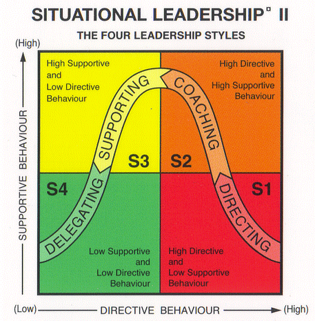
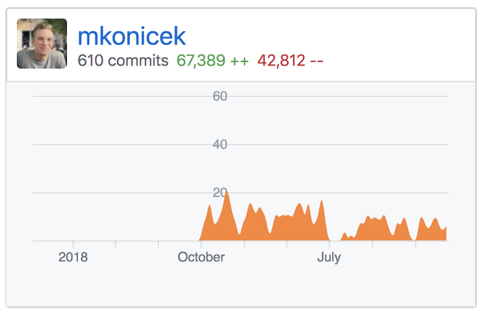

Back in 2015 and 2016 I was the tech lead for the open source side of the React Native project. Since then I have led a few other projects - mostly building large features over the course of a few months with teams of 2 to 5 engineers.

I have made mistakes along the way and learned lessons the hard way, especially at the beginning. This article summarises those mistakes and lessons.

If you are considering becoming a tech lead or recently became one, this article is for you.

## Outline

Here is an outline of this article:

- Introduction — React Native open source project
- The Basics
  - You need a roadmap
  - When pressed on time, cut down scope
  - You need a weekly meeting
  - What about coding?
- Advanced topics
  - Leading and leaving enough autonomy at the same time
  - Different leadership styles
  - One to one
  - Staying calm
- Do you want to be a tech lead?
  - Prerequisites
  - Having a supportive manager / coach
  - An easy way to start tech leading

## Introduction — React Native open source project

One day my engineering manager approached me with a challenge:

> “Let’s get you to the next level. I think you are ready to start leading a project.”

After a short chat, I agreed to be responsible for open sourcing React Native for Android. React Native for Android was being built inside Facebook. The challenge was to turn it into an open source project.

I needed to figure out a plan and start executing on it. Three other engineers from the React Native team would join a few weeks later. We had a **hard deadline** — our engineering director would announce React Native for Anroid in a confence keynote.

So here I was, with a brand new goal and no plan. I set out to do some research. The React Native code at Facebook was a folder in Facebook’s gigantic monorepo. We couldn’t simply move that folder to GitHub. We had to maintain a copy that is bidirectionally synced between GitHub and the Facebook repo. We also had to figure out how to scaffold new cross-platform React Native apps, using a build system which was different from the one we were using. The details are outside the scope of this article but if you are interested, these [slides](https://speakerdeck.com/mkonicek/under-the-hood-of-react-native?slide=51) explain the process.

After a bit of research I had a rough plan in my head and started executing on it. Then came the real challenge: _three other engineers joined me, and expected me to tell them what to work on_ 😱 If this sounds scary — good! Accepting scary challenges is the best way to learn quickly.

I made lots of mistakes and learned lots of lessons. It wasn't easy but I learned how to coordinate the team so the pieces built by different people fit together. We shipped on time and the project was a success. The rest of the article documents what I learned during this project as well as other projects that came in the years to follow.

## The basics

In this section we'll talk about the basics you should set up at the start of a project.

#### You need a high-level roadmap

I created some tasks that covered the steps for the next four weeks or so, and set up dependencies between tasks. I had a vision in my head and broke it down into maybe 20 tasks. The other engineers, however, didn't share all the context I had. It was hard to see the vision from those tasks alone. I didn't write a __basic high-level document that outlined the main decisions and steps__ in the project.

Of course, it didn't occur to me back then we needed that document. Everyone was working on their bit and making progress but I became increasingly unsure whether we were working towards a coherent product. After a while, I could tell one of the engineers was becoming unhappy. He didn't say why and it didn’t occur to me to set up a 1:1 chat and listen. I thought the people aspect of the job was very difficult.

Eventually, the engineer told my engineering manager he wanted to see the project organised better. My manager got both of us into a room. I started and said “Look, I know I’m probably messing up here. I’m trying to help us ship this project together. What can I do better?” After that he opened up and simply said he’d like to have a better picture of how everything fit together. The conversation was surprisingly easy.

Looking back at this story, it's hard for me to believe I struggled with something so simple. Something that could be resolved by a short chat. But I did struggle, and it was a part of the learning process.

I went back to my desk and wrote a one-page **Roadmap** that had a few high-level milestones in it. I sent this to my colleague and asked what he thought. He simply said “This is very good, thanks.”

This is a perfect example of something I’ve heard many times since: _Most conflicts at work happen because of a misunderstanding. To resolve it, you just need to talk._

Here is what the Roadmap looked like. Some task management systems let you create Milestones, Epics and whatnot. But there is nothing simpler and easier to understand than a document like this:

- Milestone 1: Move all the framework code to a standalone folder.
- Milestone 2: Make sure the code builds from that standalone folder.
- Milestone 3: Set up continuous syncing from our internal repo to a temporary private GitHub repo.
- Milestone 4: The open source CLI creates the iOS and Android apps, ready to go.
- Milestone 5: Update public docs.
- Milestone 6: Open source more Android modules.
- One week before launch day: Feature freeze.
- On the launch day: Publish to npm. Merge code from the private repo into the public React Native repo.

Each of the milestones had one paragraph explaining a bit of detail and links to a few important tasks.

It was mind-blowing to me how much of a difference this simple Roadmap document made. The basic outline of the project was now clear to everyone.

#### When pressed on time, cut down scope

Our roadmap described everything we needed to do in order to ship this project. Remember the conference with a fixed date where our project would be announced, no matter what?

We had six milestones. We absolutely had to get the first five milestones done. The last milestone was:

> Milestone 6: Open source additional modules, like `AsyncStorage`, `Slider`, and more.

Notice the last milestone was perfect for cutting down features if we were short on time. It was simply a long list of modules we wanted to add to the release. As the deadline was approaching we cut down the the list of the modules. A week or so before the release our engineering manager actually pushed us to drop even more modules. This was to make sure we had enough time left to properly test everything.

Because we cut down scope, React Native for Android didn’t have as many modules as we had on iOS but this was OK. In the next few releases (0.12, 0.13, etc.) we added more Android modules and eventually got to feature parity with iOS.

#### You need a weekly meeting

At the very start of the project we didn't have a weekly meeting. I knew that [meetings were a huge disruption](http://paulgraham.com/makersschedule.html) so I and wanted to help my teammates by not introducing another meeting. As I learned the hard way, not having a weekly meeting was a bad idea. The lack of the meeting meant that it was hard to stay in sync and execute on the roadmap as a team.

So I set up the meeting. It was very simple: At the start of the meeting, I would share my screen showing the current state of the Roadmap. We would talk about blockers, dependencies, figure out who's doing what next.

That simple meeting helped us so much! I would say the meeting was a basic necessity for the success of the project.

Your role as a tech lead is to:

- Run the meeting.
- Listen & ask questions. Don’t be afraid to ask any question. It's important you have full understanding, and chances are a few other people in the room probably have the same question.
- Bring up hidden dependencies and potential risks. Does your plan have any blind spots? You are the one with the big picture who thinks every day about how the puzzle fits together.
- Update the roadmap — who’s working on what, what the blockers and risks are.
- Always aim to make decisions in the meeting! If you need to do more research to make a decision, at the very least _decide_ who’s doing the research. You should make progress in every meeting.
- Make sure to write down the decisions from each meeting and share them. You can do this yourself, or rotate the responsibility among team members.

If you want more tips on running meetings, I wrote a separate [blog post on meetings](../meetings).

You might be wondering why I didn't introduce daily standups or even Scrum for example. The answer is it wasn't needed. The lightweight process with a regular weekly meeting worked great for our team. We shipped the project on time and in a good state. I've used this lightweight process with a few different teams since.

#### Note on the value of repetition

Here is one big lesson I learned during our meetings:

> When you mention something in a meeting, don't assume anyone will remember it.

I made the big mistake at first when I mentioned something crucial _just once_ and later was baffled why no one knew about it.

Just think about the information overload we all get every day. If you realise there is some information crucial for the success of the project, you have to _repeat it_. Repeat the information in your written update, repeat it again at the next weekly meeting, and repeat it again in a related Slack conversation that comes up two weeks later.

#### What about coding?

You will be writing code, and reviewing lots of code. This is the part that should feel very familiar. It is worth saying that as a tech lead you are expected to step up and tackle some of the harder technical challenges.

Note: You will write less code than before. This makes sense because you now have other responsibilities besides coding. We will discuss the balance later in this article.

#### Basics - Summary so far

So far we’ve talked about the basics responsibilities of a tech lead:

- Maintain the roadmap
- Cut down scope when necessary
- Run the weekly meeting
- Write code

As you have probably guessed, there is more to tech leading than that. Let's explore those more advanced topics.

## Advanced topics

The Basics we've covered so far should feel relatively straightforward to you. All of the Basics are mostly algorithmic: Set up a roadmap, run a weekly meeting using these few steps. If approaching a deadline, do X.

This next section is about dealing with people. It is just as important.

#### Leading and leaving enough autonomy at the same time

Imagine in your team meeting someone steps up with a strong opinion about anything - coding style, a library, a feature. Never shoot them down, especially in front of everyone, and especially if they are still learning and this is one of their first ideas they shared!

Say an engineer suggests an improvement that would take at most a few days to complete. Here are a few options:

- You totally agree with the idea. Say you agree, ask others for their opinion. Ideally you’ll get a quick conclusion and the person will ship it in the next few days!
- Sounds very reasonable but you are not sure. Aim to show trust — e.g. recently I said during a chat at our team area: “Sounds good. You own this part of the app now. Do whatever you think is best.” Sounds scary? Not if you’ve done hiring well!
- Sounds reasonable but there are many higher-priority things. Especially people new to a project sometime suggest good ideas that have relatively low impact. You should say it’s a good idea, and politely explain the roadmap and that we would likely implement the idea eventually. But if the engineer is very passionate about it, and it takes a day or two, why not just go for it? _Feels good to propose an improvement and ship it the next day!_ Unless you do this every day, you should be fine.
- The idea needs a lot of discussion first. Say something like “I’m not yet sure how it would work and it will take a while to explain. Would you mind taking time after this meeting to talk through it?” And then spend the time with the engineer 1:1 or in a small group. Understand the proposal, and figure out together how to do it and when. You might find out the idea won’t work right now because of some constraints you discover.

It’s important to realise there might be a deeper reason why someone on your team is proposing something. The people on your team are not machines that are concerned with delivering the project and nothing else. For the most part people will be mainly concerned with delivering the project. But remember that everyone has their own career aspirations, too. For example, someone new to the team wants to propose something, take ownership of it and prove they can drive it to completion.

If everyone on your team is pulling in a different direction, you have a serious problem. This never happened to me, and shouldn’t happen if your project is well defined, has a clear roadmap and support from the rest of the company.

However, it is quite common that occasionally someone on the team will come up with an improvement or have a strong opinion on how something should be done, and will push for it. If the idea is reasonable and won’t make a big difference to when you ship, IMHO you should be supportive and let them just run with it.

This brings us to the next topic on how each person on the team is different, and you often need a different approach for communicating with each of your teammates. Just when you thought things would be easy :)

#### Different leadership styles

Every person on the team is different. You have to understand what kind of support they need. There is a well known approach called Situational Leadership. It looks like this:

For each person on your team, you need to figure out which of these four categories they are in:

- S1 — lacks the knowledge, skills or confidence to complete a task.
- S2 — willing to work on the task but don’t have the necessary context yet.
- S3 — is ready to help. Has more context than S2.
- S4 — is ready to work independently. Has high level of confidence, the right skills and context.

The most important thing is that based on where the person is currently, they _want you to behave differently towards them_.

Here are a few examples:

- Someone is new to your codebase _and_ their career. They are almost definitely in S1 initially. You can help them progress to S2 quickly. Over time they should move to S3 and to S4. This can take a year or more.
- An experienced engineer who just joined your company will be and S2 or even S3 on day one. They should quickly progress to S4.

Note: The same person can be S4 when it comes to React, S2 at Docker, S3 at public speaking. That is, different levels of support are needed based on the task at hand!

How do you understand in what group each person is? This should become obvious fairly quickly when working with them day to day — talking about technical problems, doing code review. When someone joins the team and you know little about them, give them a few small and very well-defined tasks. This way you quickly get a sense of whether they are S1, S2 or S3.

Once you know where a person is, roughly, here is how to work with them:

- S1 — lacks the knowledge, skills or confidence to complete a task

Write down small, very specific, detailed tasks. The person doesn’t want exploration and freedom yet. They need to get going and build confidence. Tell them they’re doing well as they complete the small tasks!

- S2 — willing to work on the task but don’t have the necessary context yet

You should still make the call on harder technical decisions. Try to ask questions like “How would you design this part of the system?” If they are usually not sure, they are still S2. If they understand edge cases and provide more and more reasonable solutions over time, this is great. They are moving towards S3.

- S3 — is ready to help. Has more context than the previous group.

Let this person operate pretty independently. If you try to micro-manage them like an S1, they usually won’t like it! They might still need some help with technical discussions — just chat about solutions and see if you can provide some ideas. Often, your help won’t be needed as much, but sometimes help is still needed. For example, there might be an edge case or a dependency on another project happening at the company you help identify.

- S4 — is ready to work independently. Has high level of confidence, the right skills and context.

This person is killing it and knows as much as you do. Just give them something large and difficult to work on and let them run with it.

S3 and S4 can help you a great deal with your job as a tech lead. You can bounce ideas off each other and they can spot what you missed.

Don't forget people move between these categories over time. This means your approach for each person must evolve over time.

#### One to one

You shouldn't be afraid to set up an occasional 1:1 chat with each member of the team. This doesn't need to be a weekly thing. Just talk to them and ask how they feel about the project. Ask if they have any ideas what you could do better. Get to know them as a person. People are usually interested in talking about things outside the project. It could be different programming languages or things totally outside work.

The 1:1 doesn't need to be formal. It can be a chat over lunch or when you happen to bump into each other. If you work remotely and don't see each other in person then I believe setting aside 30 minutes for a call with each team member is crucial.

#### Staying calm

You’ll be working with others and relying on others much more than you are probably used to. This will inevitably have some effect on your own mood at first.

A manager once gave me very interesting advice about mood and emotions. He drew this diagram on a whiteboard:

The chart above shows that your emotions should not swing too much over time. The chart is about emotions. People are emotional. Your team members have emotions. You have emotions and cannot ignore them.

This area happens to have overlap with engineering management. As a tech lead, you won’t be directly managing the people on your team but you will have to start thinking about how people are feeling. This is one of the big parts of being a manager. Being a tech lead is therefore lightweight training for management.

—

All of the above should give you a good idea of what it is like to be a tech lead. The rest of this article asks whether you actually want to try it, and shows a way to get started.

## Do you want to be a tech lead?

From what we’ve learned so far, you can probably imagine what the Day in the Life looks like. Throughout each week you will switch between many different tasks. Let's split everything into two categories: Coding and Non-coding.

##### Coding

This should feel familiar:

- Build features like everyone else.
- Solve some of the harder engineering problems on the project.
- Give useful, timely code review. (This topic deserves its own article.)
- Volunteer to do the boring work.
- Take pride in code cleanup and refactoring.

##### Non-coding

Most of the non-coding responsibilities will be new:

- Be responsible for the delivery of a project.
- Understand what everyone is working on at any moment.
- Understand dependencies, blockers and risks.
- Create the roadmap and keep it up to date.
- Run a weekly engineering meeting.
- Help resolve disputes around scope, priorities.
- Answer technical questions, both inside and outside the team.
- Give regular updates to people outside the team. Tune the update to the audience — different level of detail if the audience is non-technical.
- Help the engineers on the team grow from S1 all the way to S4.

Given all of the above, my coding throughput looked like this:

This is my commit history from when I switched to tech leading at my current company. Before July 2019 I worked as an individual contributor. Then I took some time off in July, and after that started tech leading a project. You can see a clear drop in commit rate once I became a tech lead.

This reduced amount of time spent coding is one of the main reasons some experienced engineers don’t want to become tech leads. A friend of mine switched from being a tech lead to being an individual contributor. He wanted to spend as much time writing code as possible.

## How to start tech leading now

Do you want to give tech leading a go? Here is how.

#### Prerequisites

You need to be a relatively strong engineer before you can start thinking about becoming a tech lead. You don’t have to be the strongest engineer on the team but you should be reasonably strong.

What does it mean to be a “strong” engineer? You give timely and useful feedback on code review. You deliver features quickly and with few bugs. Your code is well structured and easy to understand. You solve some of the more difficult problems on your team. You are willing step up and do the boring work. You make improvements that make work easier for others. You take pride in cleaning up and deleting code, and know that the best code is no code at all. You can work with others effectively. You can communicate with people inside and outside the team.

In terms of situational leadership, you should be operating at S4. This is why your manager wants you to be the tech lead. They want to delegate a project to you. They want to have the confidence that under your leadership the project will ship. Of course, the manager should support you, especially if this is your first time leading a project.

If you feel like you could probably tech lead a project but it feels scary, you are ready.

#### Having a supportive manager / coach

You will be doing a lot of new and unfamiliar work, especially when it comes to dealing with people. It really helps to have someone who knows you, knows your team, knows your project and will give you advice. Ideally, this should be your engineering manager.

It was my manager who pushed me to run my first project. She supported me during our weekly 1:1s as well as outside the 1:1s. She was always responsive and available when I struggled. And I did struggle!

My employer also provided extra “tech lead coaching” sessions. We had a program called Good to Great where I would sit down with another experienced engineering manager once a week. He would ask “How is everything going?” Then he would listen and advise.

Having a great manager is not a hard prerequisite to start tech leading. You could figure it out on your own, and hopefully this article will help you. However, having someone to ask for advice is very useful.

#### An easy way to start tech leading

In my experience, it made a lot of sense to become the tech lead of a project I kick-started. I worked on the code by myself for a month or two. I did a lot of thinking and exploration.

At a great company where managers support career growth, your manager should hand you the opportunity to be a tech lead — including a project idea! In a smaller company, I asked: What are the top three big projects we should be doing? I picked one of those and started coding.

If you start the project and spend a few weeks exploring it, you will have a lot of context. As you add more people to the project it makes sense for you to provide value by coordinating.

#### Give it a try!

If the idea of becoming a tech lead feels tempting you should give it a try. If you find out you don’t enjoy it, you can always go back to being an individual contributor.

Give tech leading a try as soon as you can! I’m sure you won’t regret it.

#### Let's talk

Do you have any questions or want to share your experience? Let's talk on [Twitter](https://twitter.com/martinkonicek).
