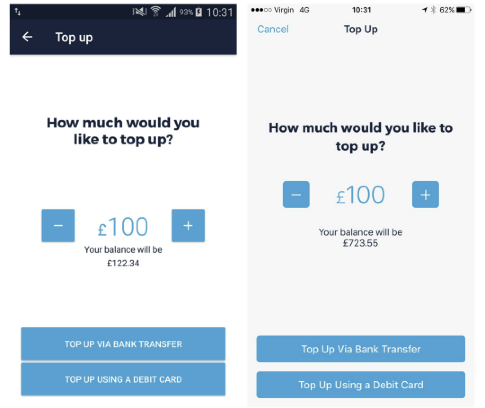

You might be familiar with the following situation:

- At your company you have separate Slack channels:
  `#ios-engineering`, `#android-engineering`.
- iOS engineers watch WWDC, Android engineers watch Google I/O.
- iOS engineers go to iOS conferences and follow iOS people on Twitter, Android engineers go to Android conferences and follow Android people on Twitter.

However, what you build are two very similar apps - both in terms of UI and business logic:

To build this experience, you use two different programming languages, two different ways of handling dependencies, different libraries, different IDEs. It seems impossible for one person to develop for both platforms and keep the knowledge up-to-date.

Apple and Google each want their platform to win and therefore want engineers to focus on their platform. Check out this talk from Google IO 2015 about the permission model in Android M. The permissions are announced as a new thing (with unique UX challenges) without mentioning the existing very similar permission model from iOS ([video](https://www.youtube.com/watch?v=f17qe9vZ8RM&ab_channel=GoogleDevelopers)).

It’s great that the first reaction from the audience is:

> “It’s good to have granular permissions. Reminds me of iOS.”

This is exactly the type of thinking we need — knowing both Android and iOS at a high-level and learning from each other. Imagine it’s 2015 and you are introducing granular permissions in your Android app. If you have an iOS engineer sitting next to you, talk to them. How do they think about permissions and user experience around them? It is very likely you will learn something useful.

#### The case for bringing iOS and Android engineers closer together

There is a lot we can learn from each other. At my last company we have successfully created close collaboration between iOS and Android engineers. For example, there is a single Slack channel `#mobile-eng`, rather than `#ios-eng` and `#android-eng`. We have a bi-weekly knowledge-share meeting where we present high-level architecture on each platform: “What are the scenarios that trigger a feed refresh?”

When two engineers work on the same feature on two platforms, they talk to each other to make sure the business logic, logging and error handling are the same on both platforms.

#### Action points

1.  Create a **single shared Slack channel** for mobile engineers at your company to replace `#android-eng` and `#ios-eng`. You’ll be surprised how much common information can be shared (product, but also high-level technical ideas). Make sure you [use threads](https://medium.com/@martinkonicek/how-to-slack-6f5bf9be71ba) to keep the Slack channel readable.
2.  To increase awareness and collaboration even more, put both the iOS and Android app in a **single repo** from day one. You will find this useful in case you need to share code between apps, too.
3.  If you’re implementing a feature that already exists on the other platform and unsure how exactly it should work, don’t hesitate to **read the code for the other platform**. You’ll be surprised how readable Java, Kotlin and Swift are if you know just one of those languages.
4.  **Try out the other OS** every now and then. If you’re an Android engineer and a friend has an iPhone, borrow it for a few minutes every time there is a new OS release and play with it. Try out what’s new, what the interactions feel like. Watch the annual main events of Google IO and WWDC. All of these are small time investments.
5.  You could go even further and use both Android and iOS as your primary device. I had an old HTC phone in 2011 (and made [my first Android app](https://www.youtube.com/watch?v=ElkmzoqD9PM) for it), then iPhone 4 (made a simple music mixing app), then Samsung Galaxy S5, Nexus 5, iPhone 7 (while still doing Android development), and now an iPhone XR.
6.  Experiment with [React Native](http://facebook.github.io/react-native/) or [Flutter](https://flutter.io/). It’s fun learning something new and you might love the idea you can build an app for both iOS and Android yourself. It’s empowering to be able to build quickly for both platforms.
