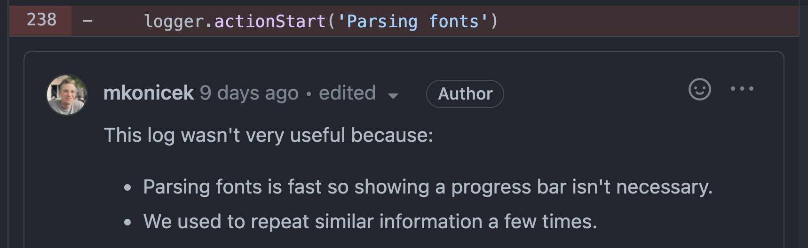
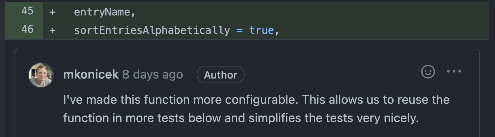
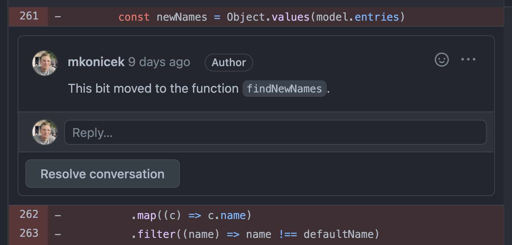
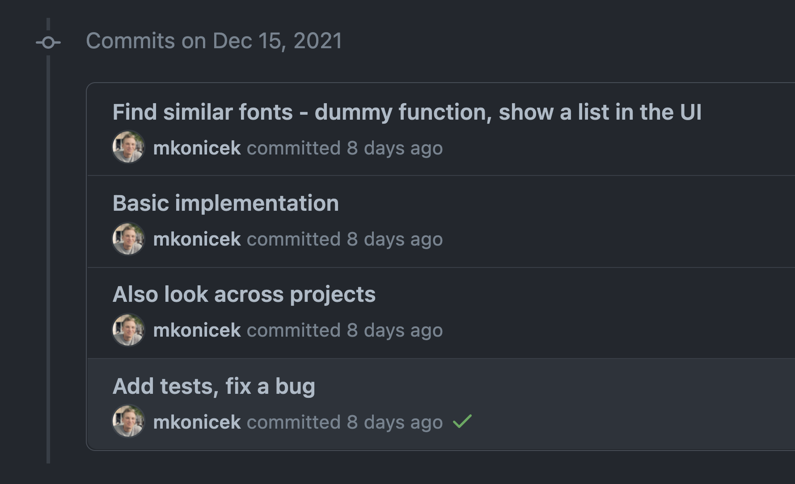
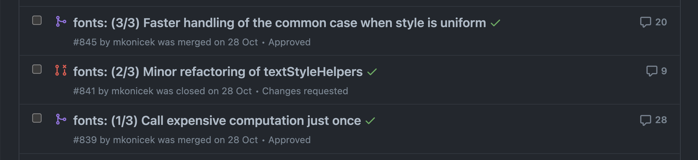

This is a post on authoring pull requests. The tricks below will help you achieve the following:

- Your pull request gets a thorough review. This leads to higher quality code. That is code with fewer bugs which is easier to maintain.
- The reviewer understands the pull request quickly. This means less work for the reviewer and less work for you answering questions and rebasing old pull requests.

### Trick 1 - Add inline comments

You should add comments on your own pull request in order to help the reviewer as much as possible.





#### “This code moved”

Explaining a piece of code simply moved is often a nice time saver.



Without the comment it looks like the code was deleted. It is not clear why. The reviewer will have to realize the exact same piece of code appeared in a different file.

Adding comments like those shown above is very quick and easy. Right after you opened the pull request you have all the context fresh in memory. It only takes a few minutes to type some comments. You will be rewarded with less back and forth communication and hopefully a quick accept! ✅

### Trick 2 - Add comments in code

This one is quite obvious. Sometimes a comment belongs in code:

```js
if (selectedFonts.length === 1) {
  // Only show the remove button if a single font is selected.
  // When multiple fonts are selected it was too easy to accidentally
  // click the button and remove all.
  return <RemoveButton />
}
```

A well known wisdom says: Every comment should explain **why** you did something. This way everyone will be able to understand the code later without having to ask questions and read through history.

### Trick 3 - Multiple commits

Some pull requests end up large and complex which makes them very difficult to review.


If you've ever had to read through a pull request with 20 changed files, 500 non-trivial changed lines, I'm sure you can imagine how much easier it would be to review smaller, logically separate pieces. Consider splitting the work into multiple commits:



A good way to split work into commits is:

1. Implement an MVP
2. Improve it

### Trick 4 - Multiple pull requests

This trick is similar to the multiple commits above, except you make one pull request per logically separate piece of your work.



Notice the number of comments on each pull request above: 28 comments, 9 comments, 20 comments. I could have made a single pull request called "Optimize performance". Managing the discussion about various parts of that pull request would be a pain both for the reviewer and me.

The advantages of splitting work into multiple pull requests are:

- The discussions are nicely separated.
- Each pull request can get approved separately and ship quicker.
- Each pull request has its own [Test Plan](/what-is-a-test-plan).

### Trick 5 - Before you open a pull request

You don't want to spend a few days writing code only to finally open a pull request and find out there was a much easier approach. For complex pull requests it is often wise to set up a meeting and write a design document before writing code.

### Summary

If you remember only one thing from this post, start **adding comments on your own pull requests**. This is the action which costs you virtually no effort and pretty much guarantees the reviewer will understand your code better and quicker.

As the next level, try to scope work into smaller bits. You don't have to find the perfect split. Any progress towards the goal helps. This will only get easier over time.
