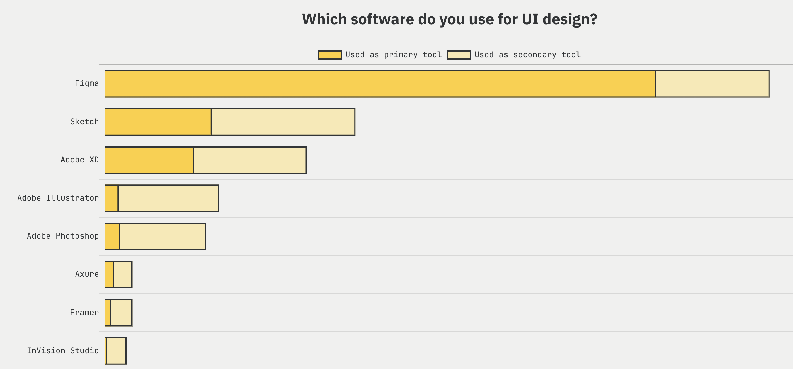

I had offers from Stripe and Spotify and was talking to a recruiter at Google. Why did I choose Figma?

## 1. I saw Figma being adopted everywhere

Within a relatively short period of time I observed the whole industry switch from Sketch to Figma. My previous company adopted Figma. The product was impressive. How did they make the editor so smooth? Spoiler alert: It’s WebGL. I checked the Figma website and saw it was used at Google, Microsoft, AirBnb, Slack, Twitter, Dropbox, Stripe, Square and more. Designers seem to love the product.

## 2. There are a lot of people to learn from

I liked what I saw on the engineering blog and was impressed during the interview process. I liked the questions were realistic - simplified versions of problems you need to solve when building an app like Figma. I could tell my interviewers were great engineers. Right after the interview I already felt like I would want to work with them.

My recruiter sent me links to LinkedIn profiles of all my interviewers. I did a bit more research to see who else worked at Figma:

[Noga Mann](https://www.timesofisrael.com/queenb-and-wework-creating-opportunities-for-girls-in-hi-tech/) started a non-profit tech education company in Israel, had an offer to be come an engineering manager at Google and decided to join Figma instead. [Emil Sjölander](https://www.crunchbase.com/person/emil-sj%C3%B6lander) worked on the layout engine for React Native, later went to YCombinator, raised money and built a team. Later the whole team decided to join Figma. [Evan Martin](http://neugierig.org/software/) worked on Chrome before it first launched in 2008 (!), [Ben Smith](https://www.youtube.com/watch?v=5N4b-rU-OAA) worked on WebAssembly and [Karl Jiang](https://www.linkedin.com/in/karl-jiang-4a07424) helped build Twitch. Check out also the awesome updates on the Twitter profile of [Lauren Budorick](https://twitter.com/lbudorick).

Note: The people mentioned above have a lot of experience. Figma also hires interns and people starting their careers.

## 3. Exciting technical challenges

There a lot of interesting technical challenges at Figma. I haven’t done any work so far which was pure CRUD. Figma is a large React app with a WebGL canvas powered by C++ compiled to WebAssembly. It’s a [rendering engine](https://www.figma.com/blog/building-a-professional-design-tool-on-the-web/) where everything has to be built from scratch: How do you lay out individual font glyphs to render text? How do you draw rounded corners, shadows, or use shaders to do various blending effects? You can also find [Rust](https://www.figma.com/blog/rust-in-production-at-figma/) at Figma. My team specifically works on Developer tools which is close to my heart, having worked on React Native in the past. Developers are great customers to work with.

Here are a few blog posts written by engineers at Figma:

- [Building a sandboxing system to safely run 3rd-party plugins](https://www.figma.com/blog/how-we-built-the-figma-plugin-system/)
- [LiveGraph: a real-time data system at scale](https://www.figma.com/blog/livegraph-real-time-data-fetching-at-figma/)
- [React at 60fps: improving scrolling comments in Figma](https://www.figma.com/blog/improving-scrolling-comments-in-figma/)
- [Figma, faster](https://www.figma.com/blog/figma-faster/)

## 4. Still a relatively small company - big opportunity for impact

Even though Figma is now [valued at over $10 billion](https://www.bloomberg.com/news/articles/2021-06-24/software-design-startup-figma-is-now-worth-10-billion), there are only around 200 engineers. At smaller companies each person has more opportunity to do something big and affect the bottom line.

And indeed, just a few months after I joined I’ve been in meetings with our CEO and VP of Product. They are very familiar with the feature we're building in our small team. Our project is one of the company-wide priorities.

At smaller companies it’s also easier to know people. After just a few months I recognised lots of names in commit messages. When people post on Slack we often already know each other.

## 5. Business Opportunity

The company is backed by top investors, ie. Sequoia, a16z, Greylock, Kleiner Perkins. See Figma on [CrunchBase](https://www.crunchbase.com/organization/figma).

A few relevant articles:

- [How Figma Became Design’s Hottest Startup, Valued At $10 Billion](https://www.forbes.com/sites/alexkonrad/2021/08/10/how-figma-became-designs-hottest-startup-valued-at-10billion/?sh=28799291726e) - Forbes
- [Investing in Figma: The Decade of Design](https://a16z.com/2020/04/30/figma/) - by Peter Levine who led the Series D investment at a16z
- [2021 UX tools survey](https://uxtools.co/survey-2021/)

Figma’s business model is SaaS which is my favorite business model. People decide to pay for Figma and FigJam because the tools bring them value. Very straightforward and fair.

## 6. Experience after joining

What else did I find out since joining Figma in September 2021?

Every single person I met at Figma I would want to work with again.

Figma has a very open open and collaborative culture. I have sent pull requests to people on different teams and they always got reviewed quickly. When I made improvements, people on different teams appreciated them.

There are weekly tech talks by engineers who share knowledge about various areas of the codebase. At the start of every larger project, you make a short presentation about your proposed architecture and get feedback from engineers across the company.

The weekly company-wide update called FigNation has lots of inspiring content and the chat is always really funny. People also ask tough questions which get answered by our CEO Dylan Field and others from the leadership team.

There’s a regular hackathon called [Maker Week](https://www.figma.com/blog/the-making-of-maker-week/) when anyone can work on anything they want. Being a maker is a part of the culture and the first question you answer in the company-wide meeting is “What makes you a maker?” (I answered I like to edit short travel videos.)

Another thing I like a lot is people take initiative. When you spot a problem or a possible project, just go for it. I’ve seen this happen multiple times.

All of the behaviours mentioned above are part of the culture and [company values](https://www.figma.com/careers/).

What I also really like is that my manager is more like a coach, actively helping me with career growth. Engineering levels and responsibilities are well defined.

## Join me!

If you’re even slightly considering something new, I recommend you look no further and interview with Figma. I’ve done a lot of research and talked to a lot of people who referred me to companies. Figma is the best company I could find. I'm happy I joined.

Message me on [Twitter](https://twitter.com/martinkonicek) or martin@figma.com.
