I’ve recently joined a startup where we use Slack as our main communication tool.

At first Slack seemed extremely chaotic but over time I learned how to use it efficiently — how to get value out of it and be responsive without wasting too much time. All I had to do was fix my settings and promote a culture of using threads.

### **td;dr**

- **Use threads**
- Short messages
- Fix your sidebar
- Semantic emojis
- All Threads screen

### Three questions

When I first started using Slack, I immediately had three pressing questions:

- **How do I see what’s important?**
- **How do I make sure to follow up?**
- **Where do I post?**

We look at these questions below:

## 1. How do I see what’s important?

By default, Slack is just a long wall of text. I can’t tell what’s relevant to me without reading all of it. Channels should help with this, so we created some. But now there are too many channels:

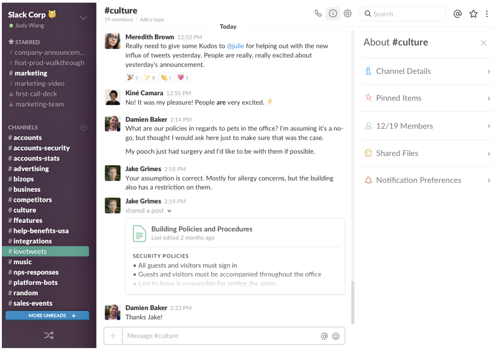

#### Fix Your Sidebar

To solve this issue of information overload, **star a few channels** you really want to keep track of:

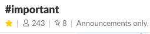

Suddenly, your sidebar is cleaner:

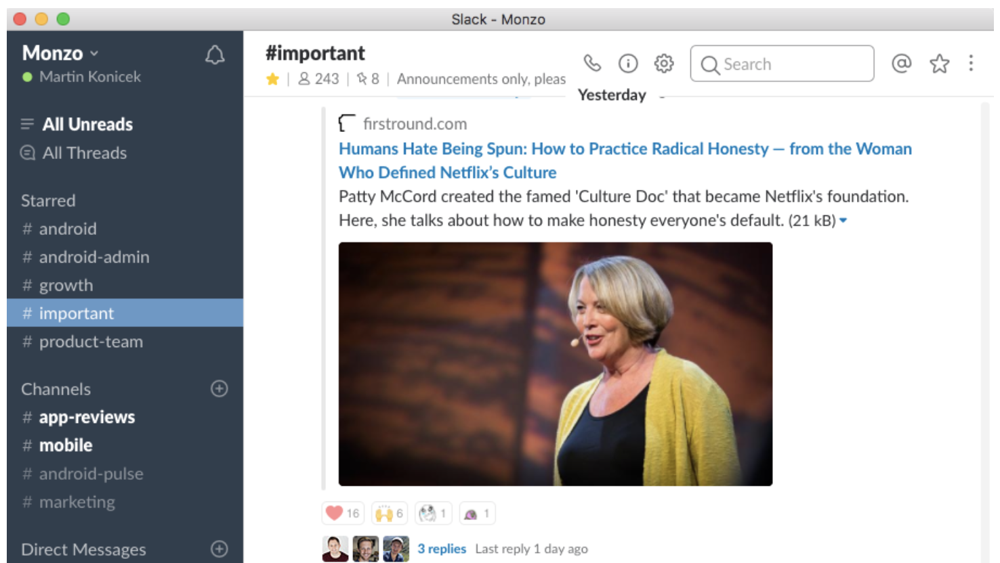

You should also **leave channels** you’re not reading anyway:

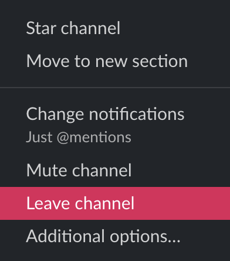

Now press **Shift+Esc** to mark everything as read and start with a clean slate. You can still jump to any channel later by pressing **Cmd+K**.

#### Fix your notification settings

It's important to only be notified about the things that matter, otherwise you get lost in the noise:

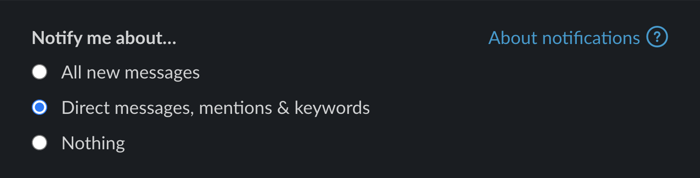

#### Use Threads for Everything

Just fixing your Slack settings is not enough. People need to communicate in a way that’s easy to parse.

Consider using **semantic emojis**. Thanks to [Emma Guy](https://twitter.com/emmaguy) for the idea. Example:

```
🔥 Something needs attention now
ℹ️ General message informing the channel
❓ Question
🔈 Announcement
💡 Idea
```

You should **start a thread for every new topic**!

I can’t stress how important threads are. Threads **completely change your Slack experience** from a chaotic screen of text into a neat list of topics.

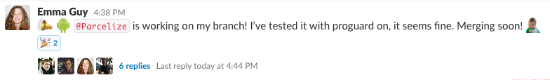

Keep the message short. If you want to add more info, add it in the first comment. With threads like this, it’s much easier to quickly scan the contents of a channel and have a good idea what’s going on.

## 2. How do I make sure to follow up?

I had the following problem. Say I’m talking to someone in a thread:

> Jami: Are we ready to ship?
> me: Yes, should I go ahead?
> <I close Slack, Jami replied a bit later>

However, I **never knew he replied**:

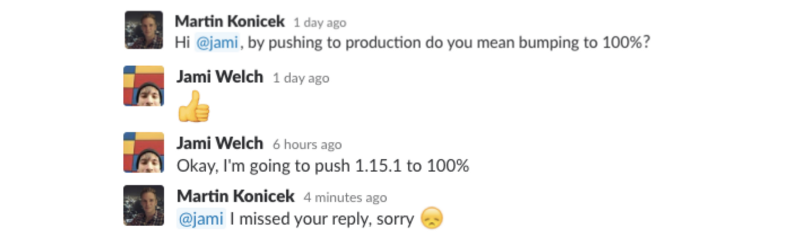

#### Use the All Threads Screen

You might suggest turning on all notifications but that will notify you for all messages in all channels. Let’s use a different solution — the awesome **All Threads** screen. It has all the discussions you’re part of, newest at the top:

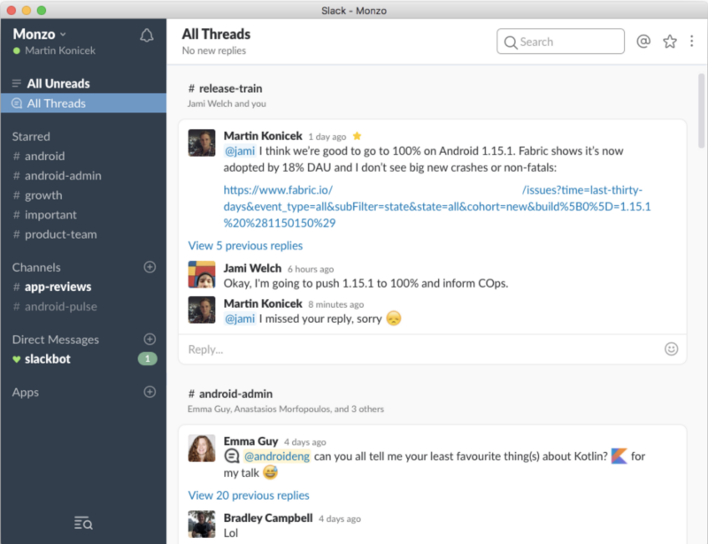

You can also create your own quick To-do list. Just save a message that’s important to you:

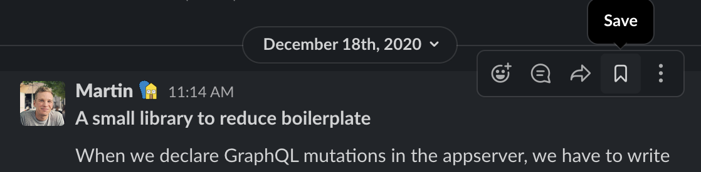

You can see all your saved messages in the sidebar:

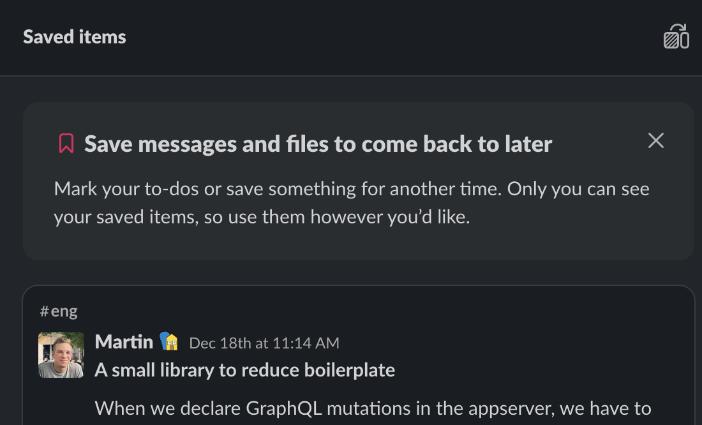

#### Help People by Mentioning Them

You can also help people see important messages by @mentioning them. Make sure you get notified when others mention you:


#### Bonus

You can go back/forward between your conversations. This only works with channels, not threads, however:

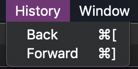

## 3. Where do I post?

The last question is: “I want to post something, but in which channel?” 🤔

Try **Cmd+K** and guess some channel names:

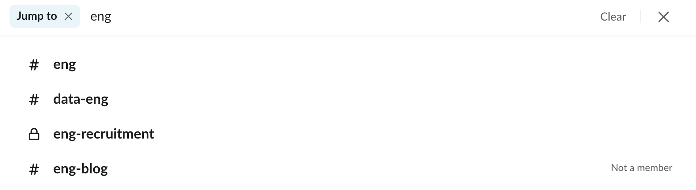

Every channel should have a topic so you know what it’s about:


#### Use Channels, not Private Messages

A big benefit of using Slack is that everyone at the company has visibility into discussions. Use channels as much as possible and avoid private messages as much as possible.

### Conclusion

That’s all I’ve learned so far. It’s just a few easy tips but they made all the difference for us, especially the usage of **threads**.

Hope these tips will help you stay focused, find important posts and enjoy Slack 👍

_If you only remember one thing from this post, remember the usage of threads:_


If you want tips on promoting the usage of threads, I wrote a [short separate post](https://medium.com/p/4a55a17d9a20).

### Appendix: Should you use Slack at all?

There are around 200 people at my company. As explained in this post, it was possible to make Slack work for us.

But what about using Workplace instead? I wrote a [separate short post about Workplace](https://medium.com/p/afd7eaa2a233).
