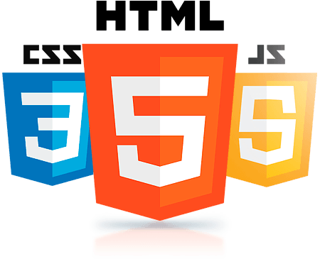

Around 2003 several of my friends were talking about web development. They were doing PHP, HTML and CSS. I got excited, bought a book about PHP, and tried building something.

I thought everything about the experience was horrible. Web development felt like trying to build an application on top of a platform that wasn’t meant to be used for applications at all. Layout using CSS was notoriously difficult, navigation between pages and trying to keep around state felt hacky.

I went back to desktop development, Direct3D and forgot about web development. Luckily there was still lots to do on desktop.

In 2008, I was working at a software consultancy on various projects. Some of the projects were web apps and needed help. I gave the web another chance. Quite quickly, I realised the web was still a mess. Seeing a few articles like “Ten weird tricks to create 3-column layout” was enough for me to abandon web development. I quit web development for the second time. Desktop apps were mostly dead but luckily mobile development - with its sane APIs designed for apps — was about to become a thing.

In 2013 I contributed to a single-page app using Backbone and Handlebars templates. It felt better than the web of 2008 but still nowhere as good to get me excited. So I quit web development for the third time. Between 2013 and 2018 I continued building for Windows desktop, backend (in Scala) and mobile (Android and React Native).

Now, I’m working on a [web app](https://synthace.com/introducing-antha/) written in React and I love it. Web development is for the first time in history a great experience. This is thanks to React, Babel, Flexbox, Webpack, npm, Prettier and ideas like [CSS in JS](https://speakerdeck.com/vjeux/react-css-in-js).

The biggest idea for me is React. Why is that? Consider all the UI frameworks across desktop, mobile and web that are trying to solve the exact same set of problems around presenting data on the screen. React was the first radically different idea. And it is such a good idea that other frameworks (including desktop, iOS and Android) should shamelessly copy React.

Flexbox made CSS sane, which is huge. Babel and later TypeScript made me more productive. Webpack and npm allow me to clearly define dependencies.

I am thankful to everyone who has pushed the web forward over the years. You’ve transformed it into the best app development platform that has ever existed. And it’s a great user experience too — cross-platform, no need to install anything, instant updates. These benefits were there since the beginning. The web always allowed us to achieve a lot, it was just a massive pain. Now it allows anyone to achieve a lot while being productive and having fun.

#### What about mobile?

I wish the user experience on mobile were as good as native. If you could load a web page and get an experience exactly as good as a native app, there would be no need to learn iOS and Android development, no need for app stores and their 30% cut, no need to build the same app two or three times. There would also be no need for projects like React Native or Flutter. It would be a much simpler world.
