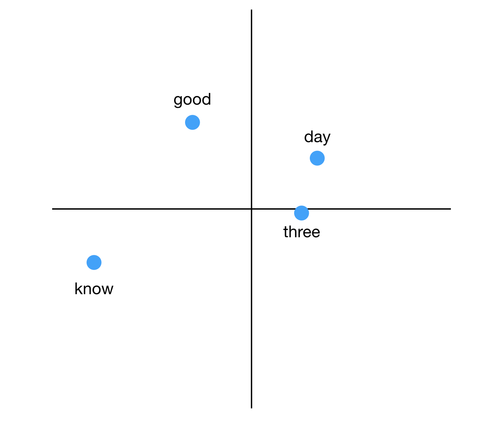
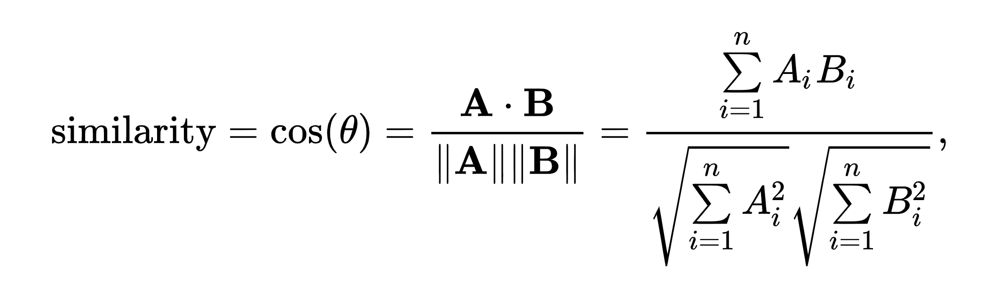
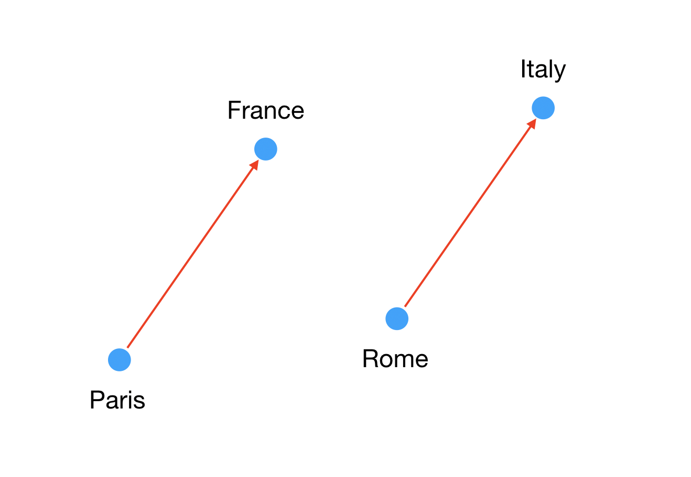

In the last few years the field of AI has advanced so quickly and so much has been written about it, chances are you‘ve heard about some impressive results in natural language processing.

For example, by reading Wikipedia a program can learn to complete analogies: `man is to king is like woman is to ___?`(queen).

I wrote a simple program to see this for myself. I was curious: **_How difficult questions can it answer?_**

This blogpost is a very light introduction to the topic. I didn’t train machine learning models. Instead, I downloaded pre-trained English word vectors created using the [fastText](https://fasttext.cc/docs/en/english-vectors.html) library.

#### First look at the data

What did fastText learn by reading Wikipedia? Let’s open the 2GB file and have a look:

```
good -0.1242 -0.0674 -0.1430 -0.0005 -0.0345 ...
day 0.0320 0.0381 -0.0299 -0.0745 -0.0624 ...
three 0.0304 0.0070 -0.0708 0.0689 -0.0005 ...
know -0.0370 -0.0138 0.0392 -0.0395 -0.1591 ...
...
```

Great, this format should be easy to work with. Each line contains one word, represented as a vector in 300-dimensional space. If this was in 2D, we could imagine it as follows:



The only difference is that each word doesn’t have 2 coordinates, but 300.

The words in the input file are conveniently sorted by frequency. Working with the most common 100k English words will be enough for my experiments, so I copied the top 100k lines to a separate file.

#### Using Python 3

To keep things simple for my first project, I decided to use plain Python 3 with zero additional dependencies. I’m also using [Mypy](http://mypy-lang.org/), a static type checker for Python.

First, we’ll define a class to represent each word:

```python
from typing import List

Vector = List[float]

class Word:
    def __init__(self, text: str, vector: Vector) -> None:
        self.text = text
        self.vector = vector
```

Next, let’s load the data into memory:

```python
words = load_words('data/words.vec')
```

We’ve parsed the file into a `List[Word]`. This part is quite straightforward so we’ll leave the details for the end of this post, and go straight to the fun stuff.

#### Cosine similarity

Now we have the vectors in memory we can answer all sorts of questions about them. The first question I had was:

> Which word is closest in the vector space to a given word?

How do we compute the distance between two word vectors a, b? You might say “Euclidean distance” but **_cosine similarity_** works much better for our use case. The idea is the absolute length of a vector doesn’t matter, what’s interesting is the **_angle between the two vectors_**.

From high school (or Wikipedia):



In Python:

```python
def vector_len(v: Vector) -> float:
    return math.sqrt(sum([x*x for x in v]))

def dot_product(v1: Vector, v2: Vector) -> float:
    assert len(v1) == len(v2)
    return sum([x*y for (x,y) in zip(v1, v2)])

def cosine_similarity(v1: Vector, v2: Vector) -> float:
    """
    Returns the cosine of the angle between the two vectors.
    Results range from -1 (very different) to 1 (very similar).
    """
    return dot_product(v1, v2) / (vector_len(v1) * vector_len(v2))
```

Now we can find words similar to a given vector:

```python
def sorted_by_similarity(words: List[Word], base_vector: Vector) -> List[Tuple[float, Word]]:
    """Returns words sorted by cosine distance to a given vector, most similar first"""
    words_with_distance = [(cosine_similarity(base_vector, w.vector), w) for w in words]
    # We want cosine similarity to be as large as possible (close to 1)
    return sorted(words_with_distance, key=lambda t: t[0], reverse=True)
```

We just need some simple utility functions to print related words:

```python
def print_related(words: List[Word], text: str) -> None:
    base_word = find_word(text, words)
    sorted_words = [
        word.text for (dist, word) in
            sorted_by_similarity(words, base_word.vector)
            if word.text.lower() != base_word.text.lower()
        ]
    print(', '.join(sorted_words[:7]))

def find_word(words: List[Word], text: str) -> Word:
    return next(w for w in words if text == w.text)
```

Time to try it out:

```
>>> print_related(words, 'spain')
britain, england, france, europe, germany, spanish, italy

>>> print_related(words, 'called')
termed, dubbed, named, referred, nicknamed, titled, described

>>> print_related(words, 'although')
though, however, but, whereas, while, since, Nevertheless

>>> print_related(words, 'arms')
legs, arm, weapons, coat, coats, armaments, hands

>>> print_related(words, 'roots')
root, origins, stems, beginnings, rooted, grass, traditions
```

Pretty impressive! It looks like words with high cosine similarity are related to each other, either syntactically (“roots, “rooted”) or semantically (“roots” and “grass”, “arms” and “legs”).

#### Complete the sentence: Paris is to France like Rome is to \_\_\_

Let’s try something more difficult. Given two words like “Paris” and “France” with a semantic relationship between them (Paris is the capital of France), and a third word, “Rome”, can we infer “Italy”?

It turns out we can simply add and subtract vectors to do this! This is because the vectors for those words have a specific relationship in space:



Surprisingly enough:

`vector(“France”) - vector("Paris") = answer_vector - vector("Rome")`

Therefore:

`vector(“France”) - vector("Paris") + vector("Rome") = answer_vector`

We’ll look for words close to `answer_vector`. The `answer_vector` won’t match “Italy” exactly but it should be close.

Let’s implement it:

```python
def closest_analogies(
    left2: str, left1: str, right2: str, words: List[Word]
) -> List[Tuple[float, Word]]:
    word_left1 = find_word(left1, words)
    word_left2 = find_word(left2, words)
    word_right2 = find_word(right2, words)
    vector = add_vectors(
        sub_vectors(word_left1.vector, word_left2.vector),
        word_right2.vector)
    closest = sorted_by_similarity(words, vector)[:10]
    def is_redundant(word: str) -> bool:
        """
        Sometimes the two left vectors are so close the answer is e.g.
        "shirt-clothing is like phone-phones". Skip 'phones' and get the next
        suggestion, which might be more interesting.
        """
        return (
            left1.lower() in word.lower() or
            left2.lower() in word.lower() or
            right2.lower() in word.lower())
    return [(dist, w) for (dist, w) in closest if not is_redundant(w.text)]

def print_analogy(left2: str, left1: str, right2: str, words: List[Word]) -> None:
    analogies = closest_analogies(left2, left1, right2, words)
    if (len(analogies) == 0):
        print(f"{left2}-{left1} is like {right2}-?")
    else:
        (dist, w) = analogies[0]
        print(f"{left2}-{left1} is like {right2}-{w.text}")
```

Let’s ask some questions:

```
>>> print_analogy('Paris', 'France', 'Rome', words)
Paris-France is like Rome-Italy

>>> print_analogy('man', 'king', 'woman', words)
man-king is like woman-queen

>>> print_analogy('walk', 'walked' , 'go', words)
walk-walked is like go-went

>>> print_analogy('quick', 'quickest' , 'far', words)
quick-quickest is like far-furthest
```

**It works!** 🎉 By reading Wikipedia, fastText learned something about capitals, genders, irregular verbs and adjectives (!) Let’s try a few more:

```
English-Jaguar is like German-BMW // Expensive cars
English-Vauxhall is like German-Opel // Cheaper cars
```

```
German-BMW is like American-Lexus // Expensive cars
German-Opel is like American-Chrysler // Cheaper cars
```

And also:

```
>>> print_analogy('dog', 'mammal', 'eagle', words)
dog-mammal is like eagle-bird
```

**The model doesn’t get everything right**

How would you complete the following analogies?

1. sushi-rice is like pizza-\_\_\_
2. sushi-rice is like steak-\_\_\_
3. shirt-clothing is like phone-\_\_\_
4. shirt-clothing is like bowl-\_\_\_
5. book-reading is like TV-\_\_\_

Sushi is made of rice and other ingredients, pizza is made of dough / salami / cheese etc. Steak is made of meat. Shirt is a type of clothing, phone is a type of electronics, bowl is a type of dish. We read a book and we watch TV.

Let’s see the answers:

```
sushi-rice is like pizza-wheat // Makes sense
sushi-rice is like steak-chicken
shirt-clothing is like bowl-food
shirt-clothing is like phone-mobile
book-reading is like TV-television
```

Also:

```
>>> print_analogy('do', 'done' , 'go', words)
do-done is like go-undertaken
```

As we can see fastText doesn’t get every single analogy right. The results are impressive but when they are wrong, they seem quite far off.

Maybe if we look at the list of suggestions rather than first one, there will be some better answers?

```
sushi-rice is like steak-
[chicken (0.58), **beef (**0.56), potatoes (0.56), corn (0.55)]

book-reading is like TV-
[television (0.68), **watching** (0.64), listening (0.57), viewing (0.57)]

shirt-clothing is like bowl-[food, cereal, rice, porridge]

shirt-clothing is like phone-[mobile, cellular]
```

In two cases, the second suggestion was really good. However, it looks like the relationship between “shirt” and “clothing” remains a mystery.

#### Conclusion

When I first saw these results on my laptop I was completely blown away. This program consists of a few lines of Python and makes you feel like it’s intelligent and actually _understands_ what you’re asking.

Once I tried a few difficult questions, I realized the program can get it “very wrong”, in a way no human would ever do. This might make you think the model is not that smart after all.

However, consider this: The vectors were trained on English text, but unlike a person, the learning algorithm had **_zero previous knowledge of English_**. _In a_ **_few hours_** of reading Wikipedia, it learned English grammar pretty well, as well as many semantic relationships between real-world concepts. It can do the same with German, Thai, Chinese or any other language given enough text.

How long does it take for a child to develop enough logical thinking until they can answer questions like the ones in this post? How about an adult learning a foreign language? How about doing that in two or three languages? It takes years for a human vs a few hours for Word2vec or fastText. People learn very differently than these algorithms. People can learn concepts better and from much less data, but it takes us much longer.

All code from this post is available on [GitHub](https://github.com/mkonicek/nlp). You’ll only need Python 3 and the [pre-trained vectors](https://fasttext.cc/docs/en/english-vectors.html) to run the code and look for interesting relationships between words for yourself.

If you liked this, follow me on [Twitter](https://twitter.com/martinkonicek).

### Appendix

I wanted to make the post as short as possible while covering the most important basics and interesting results. Feel free to continue reading for more details.

#### A small hack

When I first implemented the algorithm, I was getting wrong results, such as:

man-king is like woman-king

This is because the answer vector, computed as `answer = vector(king)-vector(man)+vector(woman)` was very close to the word “king”. In other words, subtracting the vector for “man” and adding the vector for “woman” did very little to the original vector for “king”, likely because those “man” and “woman” are related themselves.

Actually, almost all answers I got simply repeated one of the input words. I added a hack to skip these redundant words in the list of suggested answers, and started getting interesting answers as shown above. This hack is called `is_redundant` in the code.

UPDATE: Tomas Mikolov, the author of fastText, [replied](https://www.facebook.com/groups/1174547215919768/permalink/1846673885373761/), saying what I did is actually a well-known trick.

#### How were the vectors produced?

I’ve only written a few lines of code and got these amazing results. This is because all the magic lies in the vectors, trained using fastText on gigabytes of English text from Wikipedia and other sources. There are other libraries similar to fastText, such as Word2vec and GloVe. How do those libraries work? That’s quite a [large topic](https://arxiv.org/abs/1301.3781) for another post, but the idea is that words that occur in similar contexts should have similar vectors. For example if the word pizza is often found close to words like “ate”, “restaurant” and “Italian”, the vector for pizza will have high cosine similarity to the vectors for those words. Words that rarely appear in text together will have low cosine similarity, potentially all the way to -1.

#### History

Ideas like n-grams and representing words as vectors existed for a long time but it was in 2013 when the [Word2vec paper](https://arxiv.org/abs/1301.3781) and implementation were published, showing “large improvements in accuracy at much lower computational cost”. Tomas Mikolov worked on both Word2Vec and fastText.

I’m only learning about this now but better late than never :)

#### Why use types in Python?

I agree with Michael Bolin that “static typing is an essential feature when picking a language for a large software project” ([blog post](https://hackernoon.com/javascript-vs-python-in-2017-d31efbb641b4)). Types help me make the code more readable and less buggy. Even for this small project seeing errors in Atom before even running the code has been extremely helpful and saved me a lot of time.

What’s great is the Python 3 runtime accepts the type annotations. Anyone can run my code without any additional setup. There is no need to transform the code before running it, like when using Flow with JavaScript for example.

#### Optimizations

The code has not been optimized at all and doesn’t do much error handling. At the very least, we could normalize all vectors to make the computation of cosine similarity faster (one call to `sorted_by_similarity` to answer one question takes around 7s on my MacBook Pro for 100k words). We should probably use numpy. The Python process uses almost 1GB of memory. We could use an existing implementation that can simply load the file and answer questions. All of these are beyond the scope of this post. I wanted to see if I could write some very simple code from scratch to answer some interesting questions.

#### Loading and cleaning up the data

Here is what the `load_words` function does:

```python
def load_words(file_path: str) -> List[Word]:
    """Load and cleanup the data."""

    words = load_words_raw(file_path)
    print(f"Loaded {len(words)} words.")

    words = remove_stop_words(words)
    print(f"Removed stop words, {len(words)} remain.")

    words = remove_duplicates(words)
    print(f"Removed duplicates, {len(words)} remain.")

    return words
```

`load_words_raw` simply reads the file line-by-line and parses each line into a `Word`. We’ve loaded 100k words with 300 dimensions each and the Python process uses almost 1GB of memory (!) — this is bad, but we’ll live with it for now.

`remove_stop_words` throws away words that start or end with a non-alphanumeric character, such as “inter-”, “thanks.” and “--redrose64”. We are left with 98,648 words.

`remove_duplicates` ignores punctuation, so that “U.K”, “U.K.” and “UK” are the same word, stored just once. We are left with 97,190 words. There are still some duplicates, such as “years” and “Years”. We could ignore case but then we would lose the distinction between “us” and “US” (United States).
