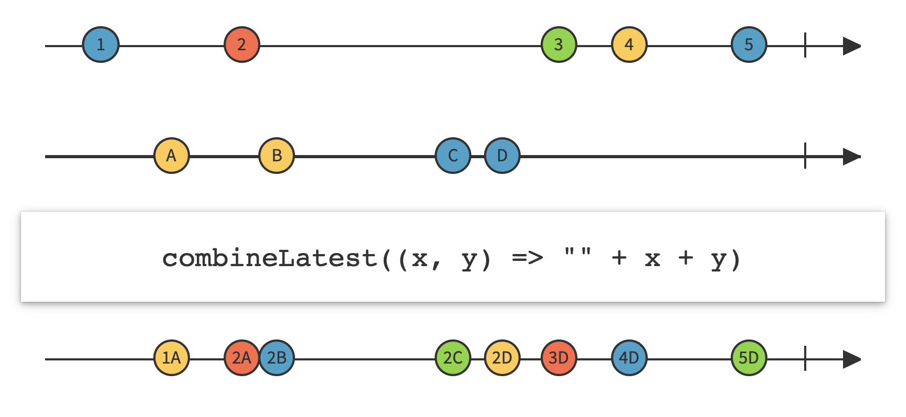
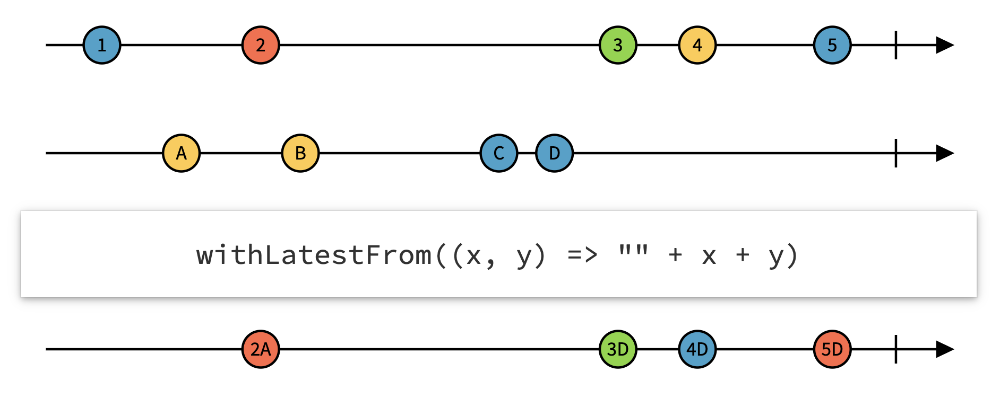
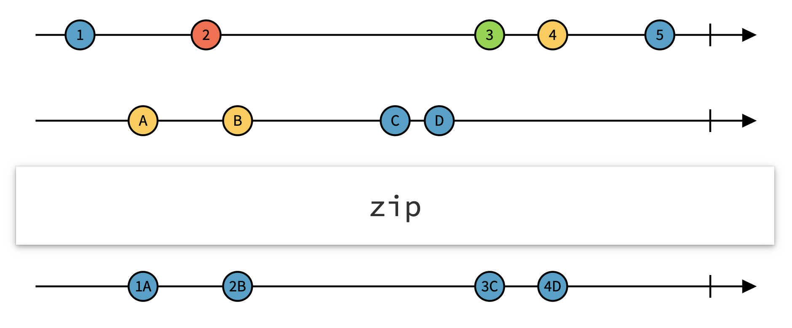
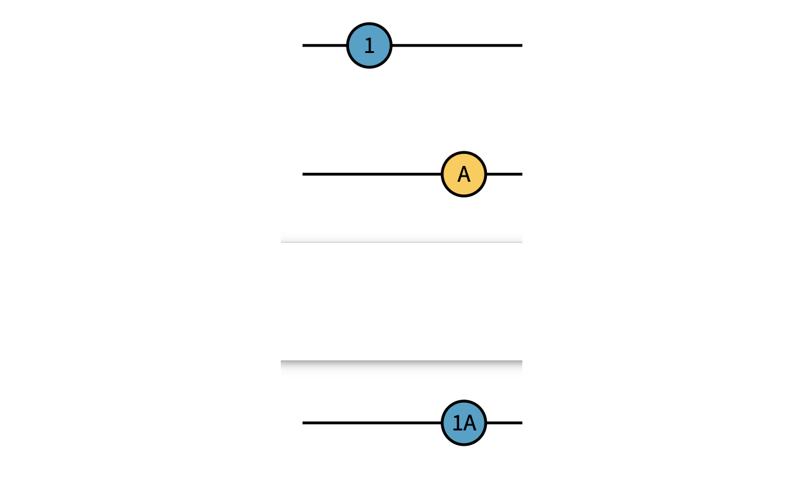

The `combineLatest` and `withLatestFrom` operators in Rx have very similar names. What’s the difference between them?

#### combineLatest

combineLatest simply combines multiple sources and emits any time there’s a new value from any of them.

Here is an example use case:

```kotlin
// All examples below are in Kotlin

disposables += Observable.combineLatest(
  view.onNameChanged(), view.onEmailChanged(), ::AccountInfo)
  .subscribe { accountInfo ->
    view.setNextStepButtonEnabled(accountInfo.isValid())
  }
```

Here is the marble diagram for `combineLatest`:



As we can see, any time there’s a new event from any of the sources we get the latest values from all sources. It’s up to us to define how the values should be combined. For example we could wrap the values in a `Pair`, or a custom object like the `AccountInfo` above.

#### withLatestFrom

Let’s say we want to build a simple screen where a person can enter their name and we want to validate the name. We can use withLatestFrom to achieve this:

```kotlin
disposables += view.onNameFocusChanged() // When focus changes
  .withLatestFrom(view.onNameChanged()) // Grab the name
  .subscribe { (focus, name) ->

    val hasLostFocus = !focus

    if (hasLostFocus && !isValidName(name)) {
      view.showInvalidName()
    } else {
      view.clearNameError()
    }
  }
```

Here is the marble diagram for `withLatestFrom`:



What this means:

- The top line are focus change events, the bottom line are name change events.
- We **only emit when focus changes**.
- When the user never entered the name, just focused and then left the input, **we don’t emit an event**.
- When the user left the input and later the name (somehow) changed, **we don’t emit an event**.

The properties above are exactly what we want for our use case (you might need slightly different UX in your use case).

#### Appendix: What about the zip operator?

Like the other operators above, the `zip` operator combines the values from multiple streams. The difference is that it waits until there is a new value from each stream. See “2” in the example below — nothing is emitted yet:



As we can see from the diagram, `zip` can be equivalent to `combineLatest` in simple cases, for example when we have just two HTTP requests:



If you know each `Observable` will emit at most one value, you should use the `Single` interface rather than Observable to make the contract explicit.
