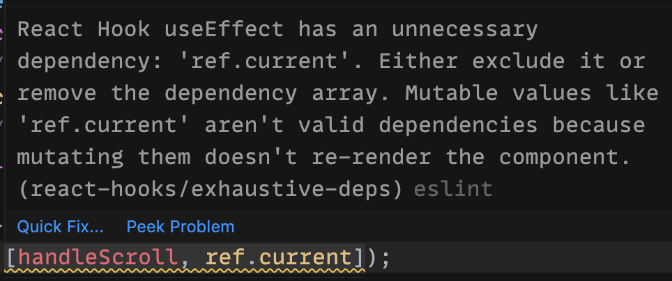

It is relatively common that we need to use a React ref to get access to a DOM element on the page. For example, we need to use a React ref in order to attach a scroll listener to a div. It turns out this is not totally straightforward.

### Starting simple

Let's use a very simple example - imagine we want to attach a scroll listener to a div on the page:

```jsx
import React, { useRef, useEffect } from "react";

export default function App() {
  const ref = useRef();

  // The scroll listener
  const handleScroll = useCallback(() => {
    console.log("scrolling");
  }, []);

  // Attach the scroll listener to the div
  useEffect(() => {
    const div = ref.current;
    div.addEventListener('scroll', handleScroll);
  }, [handleScroll]);

  return (
    <div ref={ref}>
      This is the content that scrolls.
    </div>
  );
}
```

This works fine. When we scroll, we see "scrolling" printed in the console. Here is [a working sandbox](https://codesandbox.io/s/flamboyant-wilbur-0358h?file=/src/App.js).

### Things get tricky

The example becomes more interesting once we want to display data from the server and show a loading indicator.

The example below is simplified in order to the highlight the most interesting parts. Later in this article we share a sandbox with a complete example. The gist is the following:

```jsx
const [itemsFromServer, setItemsFromServer] = useState(null);

// ...

useEffect(() => {
  fetchItemsFromServer().then(items => setItemsFromServer(items));
}, []);

// Attach the scroll listener to the div, exact same as before.
useEffect(() => {
  const div = ref.current;
  div.addEventListener('scroll', handleScroll);
}, [handleScroll]);

// If no data we render a loading indicator.
if (!itemsFromServer) {
  return <LoadingIndicator />;
}

// Otherwise we render a scrollable div.
return (
  <div ref={ref}>
    {itemsFromServer}
  </div>
);
```

Can you spot the problem? On which line will the code crash?

The code crashes here:

```js
const div = ref.current;
// div is `undefined`
div.addEventListener('scroll', handleScroll);
```

Why is that? It is because the first time our component runs we return `<LoadingIndicator />` and therefore the div is not rendered. The `ref.current` is correctly set to `undefined`.

We could try a simple fix:

```jsx
const div = ref.current;
if (div) {
  div.addEventListener('scroll', handleScroll);
}
```

Now our code does not crash anymore but also the scroll listener is never attached! Why is that? Let's take a closer look at our usage of `useEffect`:

```jsx
// This hook only runs once.
useEffect(() => {
  const div = ref.current;
  // `div` is undefined
  if (div) {
    // We never get here.
    div.addEventListener('scroll', handleScroll);
  }
}, [handleScroll]);
```

Focusing on the dependencies of the hook - the array `[handleScroll]` - we realize that the hook only runs when the function `handleScroll` changes. This dependency was automatically added by the [linter](https://www.npmjs.com/package/eslint-plugin-react-hooks) because we are using `handleScroll` inside the hook.

In practice, we know the function `handleScroll` never changes when our component re-renders. This means that our hook really only runs once. On the first render we display the loading indicator so there is no div to attach the scroll listener to. Once the data from the server has been fetched our component re-renders, and we render the div. However, our hook never runs again so it never attaches the scroll listener.

### The fragile fix

It is possible to do a one-line fix:

```jsx
useEffect(() => {
  // The first time we render, `ref.current` is undefined.
  const div = ref.current;
  if (div) {
    // The second time we render, the hook runs again and we get here.
    div.addEventListener('scroll', handleScroll);
  }
}, [handleScroll, itemsFromServer]); // Depend on itemsFromServer
```

Since we added `itemsFromServer` to the list of the dependencies the hook will now re-run and correctly attach the scroll listener to the div on the page. Our code now works.

This is great, right? Not quite.

As we just saw, the dependency on `itemsFromServer` is critical. Without this the hook does nothing useful. To someone reading the code later, however, it won't be obvious why the dependency on `itemsFromServer` is needed. They will have to understand that `itemsFromServer` is really how we decide whether to render the div that `ref` refers to! In a real-world scenario where we have much more code it will require quite a bit of effort to understand the non-obvious dependency of `ref.current` on `itemsFromServer`.

Here is a [sandbox with the example above](https://codesandbox.io/s/cool-microservice-1x5gr?file=/src/App.js).

### Cannot we just depend on ref.current?

You might want to do the following:

```jsx
useEffect(() => {
  const div = ref.current;
  if (div) {
    div.addEventListener('scroll', handleScroll);
  }
  // Now we should attach the listener
  // any time we render a new div, right?
  // Unfortunately this does not work.
}, [handleScroll, ref.current]);
```

Unfortunately, this does not work. The linter gives us a really good explanation:



This is a great linter error because it contains exactly what we need to know:

> Mutable values like 'ref.current' aren't valid dependencies because mutating them doesn't re-render the component.

