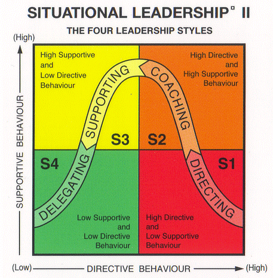
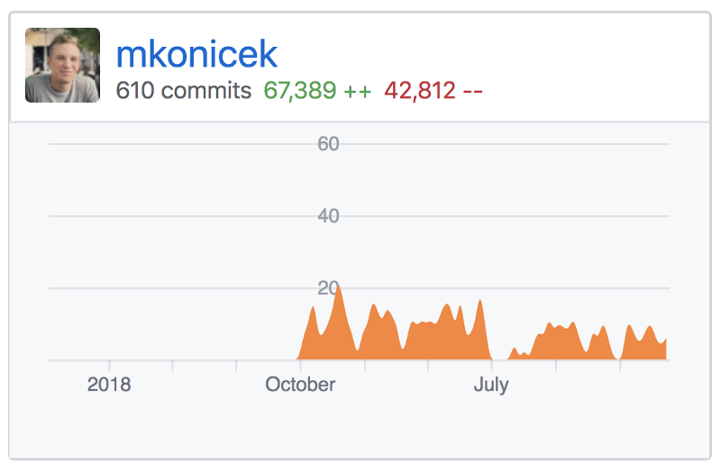

Back in 2015 and 2016 I was the tech lead for the open source side of the React Native project. Since then, I have led a few other projects - mostly building large features in teams of 2 to 5 engineers.

I have made mistakes along the way and learned lessons the hard way, especially at the beginning. This article summarizes those mistakes and lessons.

If you are considering becoming a tech lead or recently became one, this article is for you.

## Outline

Here is an outline of this article:

- Introduction — React Native open source project
- The Basics
  - You need a roadmap
  - When pressed on time, cut down scope
  - You need a weekly meeting
  - What about coding?
- Advanced topics
  - Leading and leaving enough autonomy at the same time
  - Different leadership styles
  - One to one
  - Staying calm
- Do you want to be a tech lead?
- How to get started
  - Prerequisites
  - Having a supportive manager / coach
  - An easy way to start tech leading

## Introduction — React Native open source project

Let's start with a short story on how I got into tech leading. I was an engineer on the React Native team at Facebook. One day my engineering manager approached me with a challenge:

> “Let’s get you to the next level. I think you are ready to start leading a project.”

After a short chat, I agreed to be responsible for open sourcing React Native for Android. Our team built React Native for Android. Another team inside Facebook used it to ship a new app. The next challenge was to turn the project into an open source project.

I needed to figure out a plan and start executing on it. Three other engineers from the React Native team would join a few weeks later. We had a **hard deadline** — our engineering director would announce React Native for Android in a conference keynote.

So here I was, with a brand new goal and no plan. I set out to do some research. I had to figure out how to sync the code between Facebook's gigantic monorepo and GitHub, make sure the code builds on both sides, and add support for Android into our open source tooling. The details are outside the scope of this article but if you are interested, [these slides](https://speakerdeck.com/mkonicek/under-the-hood-of-react-native?slide=51) explain the process.

After a bit of research I had a rough plan and started executing on it. Then came the real challenge: _Three other engineers joined me, and expected me to tell them what to do_ 😱

If this sounds scary — good! Accepting scary challenges is the best way to learn quickly.

I made lots of mistakes and learned many lessons. It was not easy but I learned how to coordinate the team so the pieces built by different people fit together. We shipped on time and the project was a success. The rest of the article documents what I learned during the project as well as other projects since then.

## The basics

This section explains the basics you should get in place for any new project. It shows the mistakes I made.

#### You need a high-level roadmap

Here is how I started and quickly messed up. Don't get me wrong, I tried to be organized. I created tasks that covered the steps for the next few weeks. I set up dependencies between tasks. I had a vision in my head.
My teammates, however, did not have all the context. It was difficult to understand how everything fit together.

My first mistake was that I didn't write a **basic high-level document that outlined the main decisions and steps** in the project.

It didn't occur to me we needed the document. Everyone was working on their bit and making progress but I became increasingly unsure whether we were working towards a coherent product. After a while, I could tell one of the engineers was becoming unhappy. He didn't say why. It didn’t occur to me to set up a 1:1 chat and listen. I thought the people aspect of the job was difficult.

Eventually, the engineer told my engineering manager he wanted to see the project organized better. My manager set up a meeting for the three of us. I started and said “Look, I know I’m probably messing up here. I’m trying to help us ship this project together. What can I do better?” After that my teammate opened up and simply said he’d like to have a better picture of how everything fit together. The conversation was surprisingly easy.

Looking back at this story, it is hard to believe I struggled with something so simple. Something that got resolved with a short chat. But I did struggle, and it was a part of the learning process.

I went back to my desk and wrote a one-page **Roadmap** that had a few high-level milestones in it. I sent this to my colleague and asked what he thought. He simply said “This is very good, thanks.”

This is a perfect example of something I’ve heard many times since: _Most conflicts at work happen because of a misunderstanding. To resolve them, you just need to talk._

Here is what the Roadmap looked like. Some task management systems let you create Milestones, Epics and whatnot. There is nothing simpler to understand than a document like this:

- Milestone 1: Move all the framework code into a standalone folder.
- Milestone 2: Make sure the code builds from the standalone folder.
- Milestone 3: Set up continuous syncing to GitHub. Make sure we can import pull requests.
- Milestone 4: The open source CLI creates iOS and Android apps.
- Milestone 5: Update public docs and sample apps.
- Milestone 6: Open source more Android modules.
- One week before launch: Feature freeze.
- On the launch day: Publish to npm. Merge code from the private repo into the public React Native repo.

Each of the milestones had one paragraph explanation and links to a few important tasks.

It was mind-blowing to me how much of a difference this simple Roadmap document made. The basic outline of the project was now clear to everyone.

#### When pressed on time, cut down scope

Our roadmap described everything we needed to do in order to ship this project. Remember the conference with a fixed date where our project would be announced, no matter what?

We had six milestones. We absolutely had to get the first five milestones done. The last milestone was:

> Milestone 6: Open source additional modules, like `AsyncStorage`, `Slider`, and more.

This last milestone was perfect for cutting down scope if we were short on time. It was simply a long list of modules we wanted to add to the release. As the deadline approached we cut down the list aggressively. Our engineering manager actually pushed us to drop yet more modules. This was to make sure we had enough time left to properly test everything.

Because we cut down scope, React Native for Android did not have as many modules as we had on iOS. This was OK. We released a new version every two weeks. In the next few releases (0.12, 0.13, etc.) we added more Android modules and eventually got to feature parity with iOS.

#### You need a weekly meeting

At the very start of the project we did not have a weekly meeting. I knew that [meetings were a huge disruption](http://paulgraham.com/makersschedule.html) so I wanted to help my teammates by not introducing another meeting. As I learned the hard way, not having a weekly meeting was a bad idea. The lack of the meeting meant it was difficult for us to stay in sync and "pull in the same direction".

So I set up the meeting. It was very simple: At the start of the meeting, I would share my screen showing the current state of the Roadmap. We would talk about blockers, dependencies, and figure out what to do next.

That simple weekly meeting helped us so much! More than that. It was crucial for the success of the project.

Your role as a tech lead is to:

- Run the meeting.
- Ask questions. Don’t be afraid to ask any question. It is important you have full understanding. Chances are a few other people have the same question.
- Bring up hidden dependencies and potential risks. Does your plan have any blind spots?
- Update the roadmap — who’s working on what, what the blockers and risks are.
- Always aim to make decisions in the meeting! If you need to do more research to make a decision, at least decide who’s doing the research. You should make progress in every meeting.
- Make sure to write down the decisions from each meeting  and share them. You can do this yourself or rotate the responsibility among team members.

If you want more tips on running meetings, I wrote a separate [blog post on meetings](../meetings).

You might be wondering why I didn't introduce daily standups or Scrum for example. The answer is it was not needed. The lightweight process with a regular weekly meeting worked great for our team. We shipped the project on time. I have used this lightweight process with a few different teams since.

#### Note on the value of repetition

Here is one big lesson I learned during our meetings:

> When you mention something in a meeting, don't assume anyone will remember it.

I will never forget that time I mentioned something crucial _just once_ and later was baffled why no one knew about it.

Just think about the information overload we get every day. If you realize there is some crucial information important for the success of the project, you have to _repeat it_. Repeat the information in your written update, repeat it again in the next meeting, and repeat it again in a Slack conversation that comes up two weeks later.

#### What about coding?

You will be writing code, and reviewing lots of code. This should feel very familiar. It is worth noting that as a tech lead you are expected to step up and tackle some of the harder technical challenges.

You will most likely write less code than before. This makes sense because of all the other responsibilities. We expand on this topic further down.

#### Basics - Summary so far

So far we covered the basic responsibilities of a tech lead:

- Maintain the roadmap
- Cut down scope when necessary
- Run the weekly meeting
- Write code

As you have probably guessed there is more to tech leading than that. Let's explore those juicy, more advanced topics.

## Advanced topics

The basics we covered so far are straightforward. They are mostly algorithmic: Set up a roadmap. Run a weekly meeting using these few steps. If approaching a deadline, do X.

The next section is about dealing with people. It is just as important.

#### Leading and leaving enough autonomy at the same time

Imagine in your team meeting someone steps up with a strong opinion about anything - coding style, a library, a feature. Never shoot them down, especially in front of everyone!

For example, say an engineer suggests an improvement that would take at most a few days to complete. Here are a few options:

- You totally agree with the idea. Say you agree, ask others for their opinion. Ideally you will reach a quick conclusion and the person will ship the improvement in the next few days. It feels great to propose something and ship it!
- The proposal seems reasonable but you are not sure. Aim to show trust. For example, recently I said: “Sounds good. You own this part of the app now. Do whatever you think is best.” Sounds scary? Not if you’ve done hiring well.
- The proposal is reasonable but there are many higher-priority things. Especially people new to a project sometime suggest good ideas that have relatively low impact. You should say the idea is good and politely explain there are high-priority things on the roadmap. But if the engineer is very passionate about the improvement and it only takes a day, why not just go for it? Unless you do this every day, you should be fine.
- The idea needs more discussion. Say something like “I don't yet understand how it would work and it will take a while for me to understand. Can we have a separate chat about it?” And then spend the time with the engineer 1:1 or in a small group. Understand the proposal, and figure out together how to execute on it and when. You might find out the idea wouldn't work because of constraints you discover.

It is important to realize there might be a deeper reason why someone on your team is proposing something. The people on your team are not machines that are concerned with delivering the project and nothing else. For the most part, people will be concerned with delivering the project. But remember that everyone has their own career aspirations, too. For example, someone might propose an idea because they want to prove they can take ownership and deliver.

If everyone on your team is pulling in different directions, you have a serious problem. This never happened to me, and should not happen if your project is well defined, has a clear roadmap and support from the rest of the company.

However, it is quite common that occasionally someone on the team will come up with an improvement or have a strong opinion on how something should be done. If the idea is reasonable and won’t make a big difference to when you ship, IMHO you should be supportive and let them just run with it.

Each person on the team is different, and you often need a different approach for communicating with each of your teammates. This brings us to the next topic - leadership styles.

#### Different leadership styles

Every person on the team is different. You have to understand what kind of support they need. There is a well known approach called Situational Leadership. It looks like this:

For each person on your team, you need to figure out which of these four categories they are in:

- S1 — lacks the knowledge, skills or confidence to complete a task.
- S2 — willing to work on the task but does not have enough context.
- S3 — is ready to help. Has more context than S2.
- S4 — is ready to work independently. Has high level of confidence, the right skills and context.

Based on where the person is, they _want you to behave differently towards them_. Here are a few examples:

- Someone is new to your codebase _and_ their career. They are almost definitely at S1 initially. You should help them progress to S2 quickly.
- An experienced engineer who just joined your company will be at S2 or even S3 on day one. They should quickly progress to S4.

Note: The same person can be at S4 when it comes to React, S2 at Docker, S3 at public speaking. That is, different levels of support are needed based on the task at hand!

How do you know what group each person is in? This should become obvious fairly quickly when working together — talking about technical problems, reviewing code. When someone joins the team and you know little about them, give them a few small and very well-defined tasks. This way you quickly get a sense of whether they are at S1, S2 or S3.

Once you know where a person is, here is how to work with them:

- S1 — lacks the knowledge, skills or confidence to complete a task

Find tasks that are well defined and can be completed quickly. Make sure to add lots of detail to each task. The person does not want exploration and freedom yet. They need to get going and build confidence. Tell them they are doing well as they complete the small tasks!

- S2 — willing to work on the task but does not have enough context

You should still make the call on harder technical decisions. Try to ask questions like “How would you design this part of the system?” If they are usually not sure, they are still at S2. If they understand edge cases and provide more and more reasonable solutions over time, this is great. They are moving towards S3.

- S3 — is ready to help. Has more context than the previous group.

Let this person operate pretty independently. If you try to micro-manage them like you did at S1, they usually won’t like it! They might still need some help with technical discussions — just chat about solutions and see if you can provide ideas. Your help won’t be needed as much, but sometimes help is still needed. For example, you might identify an edge case or a dependency on another project.

- S4 — is ready to work independently. Has high level of confidence, the right skills and context.

This person is killing it and knows as much as you do. Just give them something large and difficult to work on and let them run with it.

People operating at S3 and S4 can help you a great deal with your job as a tech lead. You can bounce ideas off each other. They often spot what you missed.

Don't forget people move between these categories over time. This means your approach for each person must evolve over time. And you should help people progress from each category to the next, trusting them with larger tasks over time.

#### One to one

You should not be afraid to set up an occasional 1:1 chat with each member of the team. This doesn't need to be a weekly thing. Just talk to them and ask how they feel about the project. Ask if they have ideas about what you could do better. Get to know them as a person. People are usually interested in talking about things outside the project. It could be different programming languages or things totally outside of work.

The 1:1 doesn't need to be formal. It can be a chat over lunch or when you happen to bump into each other. If you work remotely and don't see each other in person I believe setting aside occasional 30 minutes with each team member is important.

#### Staying calm

You will be relying on others more than you are probably used to. This will inevitably have some effect on your own mood at first.

A mentor once gave me interesting advice about mood and emotions. He drew this diagram on a whiteboard:

The chart above shows that your emotions should not swing too much over time. Yes, the chart is about emotions. Everyone on the team—including yourself—have emotions. You must pay attention to them.

This area happens to have some overlap with engineering management. As a tech lead you won’t be directly managing people but you will have to start thinking about how people feel. Understanding how people feel is one of the many responsibilities of a manager. Being a tech lead is therefore lightweight training for management.

## Do you want to be a tech lead?

After reading the above, you should have a good idea what it is like to be a tech lead. Do all the non-coding responsibilities make you excited?

You should also consider that you will be writing less code than before. Each week you will switch between many different tasks. You will write and review code but you will also do many other things like run meetings, maintain the Roadmap, coordinate releases with other teams and more.

Here is what my commit history looked like:

Before July 2019 I worked as an individual contributor. Then I took some time off in the summer. At the end of the summer I started tech leading a project. You can see a clear drop in commit rate.

This reduced amount of time spent coding is a reason why some experienced engineers don’t want to be tech leads. A friend of mine switched from tech leading to being an individual contributor. He wanted to spend as much time writing code as possible.

## How to get started

Assuming you answered "Yes" to the question "Do you want be a tech lead?", in this final section we discuss what you need to get started.

#### Prerequisites

Before you start tech leading, your technical skills should be relatively strong.

What are those important technical skills? You give timely and valuable feedback on code review. You design and deliver complex features quickly and with few bugs. Your code is well structured and easy to understand. You solve some of the more difficult problems on your team. You are willing step up and do the boring work. You make improvements that make work easier for others. You take pride in cleaning up and deleting code, and know that the best code is no code at all.

Last but not least, you can work with others effectively. You communicate well with people inside and outside the team. A big part of being a tech lead is about communication, after all.

In terms of situational leadership, you should be operating at S4. This is why your manager wants you to be the tech lead. They want to delegate a project to you. They want to have the confidence that under your leadership the project will succeed. Of course, the manager should support you, especially if this is your first time leading a project.

If you feel like you could probably be a tech lead of a project but it feels scary, you are ready.

#### Having a supportive manager / coach

You will have new responsibilities, especially when it comes to dealing with people. It really helps to have someone who knows you, knows your team, knows your project and will give you advice. Ideally, this should be your engineering manager.

It was my manager who pushed me to run my first project. She supported me during our weekly 1:1s as well as outside the 1:1s. She was always responsive and available when I struggled. And I did struggle!

My employer also provided extra “tech lead coaching” sessions. We had a program called Good to Great where I would sit down with another experienced engineering manager once a week. He would ask “How is everything going?” Then he would listen and advise.

Having a great manager is not a hard prerequisite to becoming a tech lead. You could figure it out on your own, and hopefully this article will help you. Having someone to ask for advice makes things easier.

#### An easy way to start tech leading

One of the responsibilities of an engineering manager is to help each engineer with career growth. Your manager should hand you the opportunity to be a tech lead — including a project idea! Make it clear to your manager you want to work towards tech leading.

At a smaller company with not much engineering management in place, I asked: "What are three most important large projects we should be doing?" I picked one of those and started coding.

If you start the project and spend a few weeks exploring it, you will have a lot of context. As more people join the project it makes sense for you to provide value by coordinating.

#### Give it a try!

Give tech leading a try. The risk is low. If you find out you don’t enjoy tech leading, you can always go back to being an individual contributor. The upside of learning new skills is great.

Just do it!

#### Let's talk

Do you have any questions or want to share your experience? Let's talk on [Twitter](https://twitter.com/martinkonicek).
