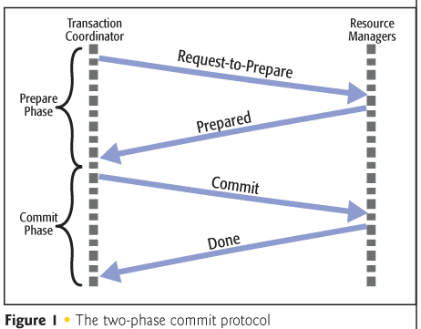
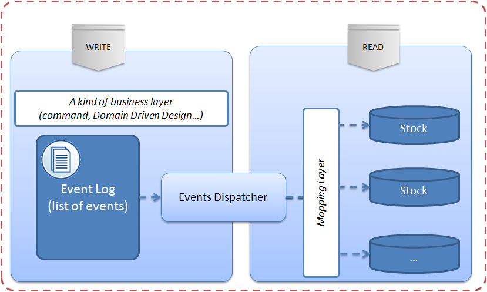

This article covers the following:

- The problem of updating multiple systems consistently
- Distributed transactions
- Event sourcing

You might already be familiar with the common "real world" example of transferring money from one bank account to another:

```sql
START TRANSACTION;

UPDATE balance SET amount = amount - 1000
WHERE account_id = @id_from;

UPDATE balance SET amount = amount + 1000
WHERE account_id = @id_to;

COMMIT;
```

This example, however, is quite naive as it assumes both accounts are stored in a single database. In practice, we want to transfer money between banks, and we still want to achieve consistency (no matter what error occurs, either both updates take place, or none).

This problem appears in many situations in practice. For example:

- In an e-shop, we want to create an order in our database and create a charge in a payment system. Again, both actions should happen, or none.
- We want to atomically update multiple documents/values in a noSQL store.

In this article, we will look at two solutions to this problem - a rather classical one (Distributed transactions) and a more recent one (Event sourcing).

### Distributed transactions

It is possible to solve the consistency problem using [distributed transactions](https://en.wikipedia.org/wiki/Distributed_transaction). A common algorithm to ensure correct completion of a distributed transaction is the **two-phase commit**:



1. One node is designated the transaction coordinator. This can be your application or an external service.
2. The transaction coordinator sends a **Request to prepare** message to all participants and waits for replies from all participants.
3. The participants execute the transaction up to the point where they would commit. They each write an entry to their undo log and an entry to their redo log.
4. Each participant replies **Prepared** if its actions succeeded, or Failed if it experienced a failure that will make it impossible to commit.

##### Success

If the coordinator received a Yes vote from all the participants:

1. The coordinator sends a Commit message to all participants.
2. Each participant completes its transaction, releases held resources, and sends an acknowledgement to the coordinator.
3. The coordinator completes the transaction when all acknowledgements have been received.

##### Failure

If the coordinator received a No vote from any of the participants (or the response timeout expires):

1. The coordinator sends a Rollback message to all participants.
2. Each participant undoes the transaction using its undo log, releases held resources, and sends an acknowledgement to the coordinator.
3. The coordinator marks the transaction as failed when all acknowledgemens have been received.

As you can see, this protocol is quite complicated, even though it only describes the success path (normal operation).

In practice, timeouts and retries have to be added into several steps of the algorithm, because it is [impossible](https://en.wikipedia.org/wiki/Two_Generals%27_Problem) to guarantee reliable exactly-once delivery of messages. For example, let's look at the Step 2 of the Success case:

> 2. Each participant completes its transaction, releases held resources, and sends an acknowledgement to the coordinator.

Notice that if the acknowledgement gets lots (e.g. due to a network partition), the coordinator doesn't know if the participant commited or not and therefore can't delare the transaction successful. The other participants should roll back. But what if the unresponsive participant already commited?
It is possible to solve all such issues, and there are working implementations. Getting every failure case right is, however, quite tricky.

Moreover, and this is the major drawback of distributed transactions, each of the systems involved has to support the distributed transactions protocol, which is simply not the case in practice. In particular, if your application uses a noSQL database or external web services, distributed transactions are not an option.

(Note, however, that distributed transactions are not a thing of the past. Google's [Spanner](http://research.google.com/archive/spanner.html) database relies on distributed transactions and two-phase commit across datacenters to achieve consistency. Spanner relies on a precise time API using GPS and atomic clocks to achieve good scalability of writes.)

This leads us to the second part of this post: In case you cannot or do not want to use distributed transactions, is there a solution that achieves consistency across heterogeneous systems? It turns out there is, although it only guarantees eventual consistency. Enter _event sourcing_.

### Event Sourcing



[Event sourcing](https://martinfowler.com/eaaDev/EventSourcing.html) is an architectural pattern that will help us achieve weaker, eventual, consistency across services. Eventual consistency simply means that consistency is reached eventually, but the system might temporarily be seen in an inconsistent state. It turns out this is sufficient for many applications, [including banking](http://highscalability.com/blog/2013/5/1/myth-eric-brewer-on-why-banks-are-base-not-acid-availability.html).

##### Requirements

For Event sourcing, the only requirement is that it is OK for any participant to receive the same message multiple times - in other words, to see each message at least once. If receiving a message multiple times always leads to the same state as receiving the message once, we say the message receiver is **idempotent**. Luckily idempotence is quite common in practice. For example:

- It is OK to update a user's name to the same value multiple times.
- It is OK to try to create a user with the same email multiple times: the user will be created once and the subsequent requests fail because a user with given email already exists.

##### Algorithm

We will use the banking example to describe the algorithm. Let's say our application / service is responsible for transferring money between two distinct banks:

1. Our service receives a request to transfer $1000 from `account_A` to `account_B`.
2. Check with bank A that `account_A` has sufficient funds available. If not, return an error to the client.
3. Create a single commit record containing the following two events. Add random globally unique ids (e.g. UUIDs) that will identify each transaction. We will see later why these ids are necessary for idempotence:

   - "Transaction_id=a1: Withdraw $1000 from account_A."
   - "Transaction_id=b1: Deposit $1000 to account_B."

4. Mark the commit record as `Undispatched` and store it in a database.
5. Pass the events one by one to our application's event listeners. Let's say we have a single listener that processes all banking events:

   - The event listener receives the first event, sends a request to bank A's service and waits for a response.
   - The event listener receives the second event, sends a request to bank B's service and waits for a response.

6. If both events are processed successfully by the listener, mark the commit as `Dispatched`.

##### Failures

Now we get to the interesting part - the possible failure scenarios. Notice that we will sometimes retry events, and we will also retry all `Undispatched` events on startup of our service in case it crashed:

Step 4: Our database fails to store the commit. We return a 5xx response to the client saying the request couldn't be processed. The state of all systems stays unchanged.

Step 5.1 - first request fails: The request to the bank A's service fails or times out. We stop the processing, leave the commit marked as Undispatched and schedule a retry. This can be done e.g. by trying to re-run the listeners of all undispatched commits every minute.

Regarding the response we return to the client, this really depends on our use case. We can return a response saying that the request was accepted for processing.

After several unsuccessful retries, we mark the commit as Failed and notify the client (via in-app notifications, or email) that the request couldn't be completed.

Step 5.2 - second request fails.: The request to the bank A's service completes but the request to bank B's service fails. We leave the commit marked as Undispatched and schedule a retry.

When trying to re-process the commit, the listener will try to execute both requests again, including the already completed first request "Transaction_id=a1: Withdraw $1000 from account_A.". Here's where the **idempotence** requirement comes in: Bank A's service must be able to recognize that it already received the message with id=a1 and ignore it.

If a retry succeeds, we are done. If it doesn't, we'll try again in a minute.

After several unsuccessful retries, we mark the commit as Failed and notify the client. Since we have already withdrawn the amount from account A, we need to execute a compensating action: "Return the $1000 from transaction a1 to account_A."

Note that marking the event as `Failed` and executing the compensating action has to be done atomically, so we use a new event for that. The compensating action itself can fail, but in this case we probably don't want to give up so if the compensating actions keeps failing we notify an operator who will make sure to manually return the money to `account_A`.

Step 5.1 or later - our service crashes: After the first request or both requests completed successfully, our service crashes. The commit stays in the `Undispatched` state. When our service is restarted it goes through all the undispatched events in the database. It will re-run both listeners, both web services will ignore the requests because they've received them already, and finally our service will mark the commit as Dispatched.
