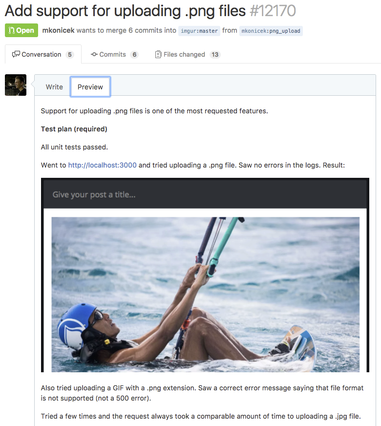
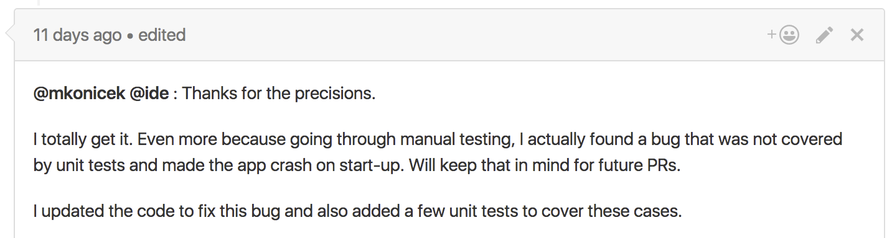

When you make contributions to [React Native](https://github.com/facebook/react-native) you'll be asked to provide a Test Plan along with your pull request.

A test plan is a bit of text (often with screenshots) that proves your code works. This post explains how to write test plans and why they are useful.

#### Example Pull Request

Let’s say you’re working on a website called Imgur that allows people to share images. People can upload .jpg files and you’d like to support uploading .png files.

You write some code and try that it works. You run the website locally, then click ‘Upload’ and see something like this:


They you drag a .png file into the browser and see the file was uploaded and displayed. Great, your code works!

Now you send a pull request so team members can review your code. You explain two things:

- Why should we merge this? For example, it’s a highly requested and useful feature.
- Is it safe to merge? Answering this question is the point of the test plan.

Here is what your pull request will look like:



The test plan is there to **prove the code works.**

Thanks to the test plan, your teammates know they can merge the code without breaking the product.

#### Is a test plan actually useful?

Why not just say “My code works, I tried it locally”?

See the example test plan above. Besides trying the happy path (uploading a .png file), it also covers:

- Error handling (uploading an invalid file)
- Performance

Showing you thought about error handling saves time answering follow-up questions by reviewers: “What happens if I upload an invalid file?”. It’s not enough to have a branch in the code handling invalid files. You check that branch works, and show in your test plan you tried. We all sometime miss an edge case. Edge cases are an important source of bugs.

Here is a comment from the React Native repo:



#### Common mistake — code breaks existing functionality

There is an important thing missing in the test plan above.

Let’s say the list of changed files looks like this:

```
(Modified) parseFileHeader.c
(Modified) upload.js
...
```

Uploading .png files works. However, by touching those files there is a real chance **.jpg upload is now broken**. Without also trying to upload a .jpg file locally, we cannot know. Therefore the test plan should also say:

> Also tried uploading a .jpg file, works as before.

#### Checklist

These are the things to cover in any pull request:

- Happy path
- Error handling (uploading invalid file, uploading when offline, …)

#### Automated tests

Your project is likely to have unit tests and hopefully also integration tests. It is likely, however, that not every code path is covered by integration tests. Think about it this way: You wouldn’t write code locally, run tests, never run the app, and commit the code.

Automated tests are very useful and they will catch stuff that you forgot about. But at the same time they will miss things that you check manually. You should consider adding a test and saying:

> Besides the manual testing, also added an integration test.

How much you rely on automated tests depends on the type of your project. Let’s say you work on the Oracle database engine. Then every line of code is covered by tests. If you work on a database engine it might make sense to simply say “All tests passed” in your test plan.

#### Conclusion

Personally I’ve learned that code reviews and test plans are worth it. They help discover bugs and increase code quality.

Consider asking people on your team for a test plan and adding one to your next pull request.
