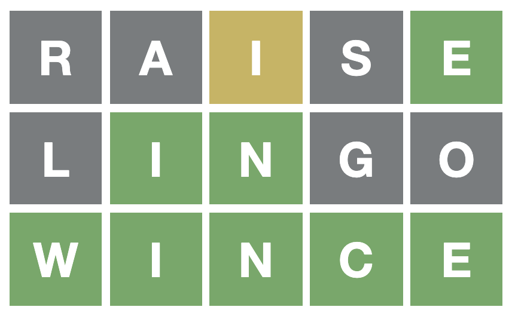
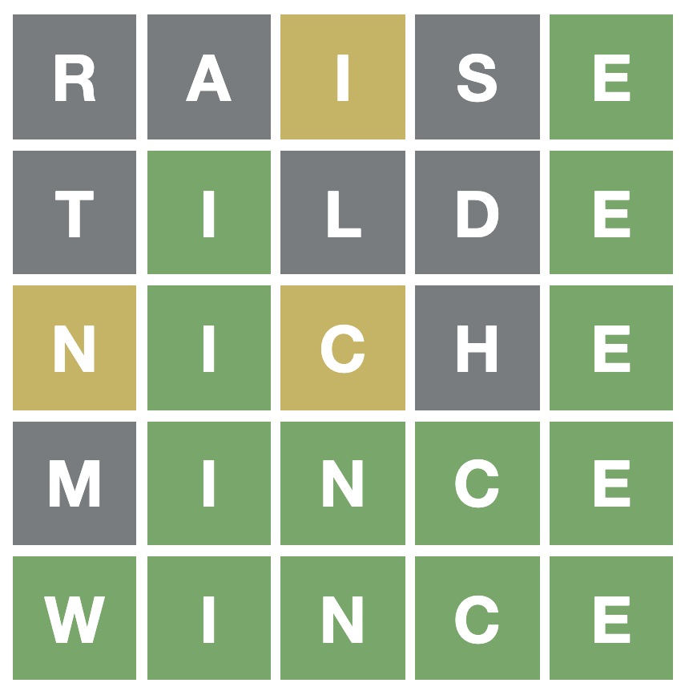

[Wordle](https://www.powerlanguage.co.uk/wordle/) is a fun game which became very popular at the beginning of 2022. After playing the game a few times it became clear the hard part was coming up with words which satisfy the constraints which would be trivial for a program to do.

Here is an example Wordle solved by the program described in this blog post:



Here is how the program described below does solving 2k different games of Wordle:

```txt
Played 2315 games of Wordle
1 attemps: 1
2 attemps: 1
3 attemps: 762
4 attemps: 1335
5 attemps: 200
6 attemps: 16
Average attempts: 3.769
Unsolved Wordles: 0
Solved: 100%
Time taken: 57s
```

The games we use for evaluation are the real 2135 words the Wordle game uses, copied from the website's source code.

The program uses "learn" and "sight" as the two starting words in any game and then tries to converge on the solution as quickly as possible.

Other starting words which work in a very similar way, only slightly worse are "lions", "earth" with 7 Wordles unsolved, and "coast", "liner" with 6 Wordles unsolved. What these word combinations have in common is they cover 10 very common letters.

We also describe an algorithm which uses a single fixed starting word "raise", does only slightly better but runs much slower:

```txt
Statistics:
1 attemps: 1
2 attemps: 79
3 attemps: 909
4 attemps: 1117
5 attemps: 178
6 attemps: 24
Unsolved Wordles: 7
Solved 99.70%
Average attempts: 3.634
```

### The basics - find possible words

I started by downloading a list of about 4000 words of length 5 and saved them to a file called `words.txt`. Then I set off to build the basic outline of the program. Here is an example run of the program:

```sh
$ python3 wordle.py
Which word did you guess? ninja
What was the color of character n? b
What was the color of character i? g
What was the color of character n? g
What was the color of character j? b
What was the color of character a? b
OK, there are now 30 possible words: finer, wince, mince, hinge, pinto, cinch, piney, minty, singe, diner, winch, since, minor, dingo, vinyl, finch, lingo, bingo, windy, liner, miner, minim, minus, dingy, binge, pinky, sinew, kinky, rinse, pinch
```

The code looked like this:

```python
words = load_words("words.txt")

# Set of characters allowed at each position
allowed = [set(), set(), set(), set(), set()]
# Set of characters we know must appear somewhere in the word
must_appear = set()
# Init all allowed sets with characters a..z.

possible = words
while True:
  guess = input("Which word did you guess? ")
  for i in range(len(guess)):
    # For simplicity of the example we skip error handling, for example
    # checking the input has the correct length (5 characters).
    g_char = guess[i]
    res = input(f"What was the color of character {g_char}? ")

    if res == 'b':
      # Black character. Remove it from allowed sets in all positions.
      for j in range(len(guess)):
        if g_char in allowed[j]:
          allowed[j].remove(g_char)

    if res == 'y':
      # The yellow character must appear in the word.
      must_appear.add(g_char)
      # But the yellow character cannot be at this position.
      if g_char in allowed[i]:
        allowed[i].remove(g_char)

    if res == 'g':
      allowed[i] = { g_char }

    possible = find_possible(possible, allowed, must_appear)

    print(
      f"OK, there are now {len(possible)} possible words:",
      ', '. join(possible)
    )
    if len(possible) == 1:
        exit()
```

And the function `find_possible` looks like this:

```python
def is_possible(word, allowed, must_appear):
  for i in range(len(word)):
    if word[i] not in allowed[i]:
      return False
    for m in must_appear:
      if m not in word:
        return False
    return True

def find_possible(words, allowed, must_appear):
    return [word for word in words if is_possible(word, allowed, must_appear)]
```

This was fun and works well. However, when the program presents a list of 30 words we still have to think in order to narrow down the list. Can we make the program choose a good next word?

### Choosing the next word

After a bit of experimentation I settled on the following heuristic: Choose a word which:

- Has characters which don't appear too often in the remaining words. This might help disambiguate.
- Has characters which are frequently used.

I haven't put much thought into this heuristic. I tested it by playing a few games on an [app with unlimited games of Wordle](https://apps.apple.com/us/app/puzzword-5-letter-word-puzzle/id1602799021). It worked reasonably well. It would solve almost all Wordles I tried.

In Python:

```python
# So we know which characters are the most common
def character_frequencies(words):
  freq = {}
  for word in words:
    for char in word:
      if char in freq:
        freq[char] = freq[char] + 1
      else:
        freq[char] = 1
  return freq

# Assign a score to each suggestion
def suggestion_score(suggestion, possible, freq):
  score = 0
  for c in suggestion:
    for p in possible:
      if c in p:
        # The more words this character appears in
        # the lower score it gets.
        break
    # The more common character this is across our
    # dictionary the higher score it gets. We want
    # to avoid using obscure characters.
    score = score + freq[c]
  return score

# Choose a few suggestions with a high score
def suggestions(words, possible, allowed, freq):
  # We also removed all words from the list which were
  # a permutation of another word. Omitted for brevity.
  suggestion_words = [w for w in words if satisfies_allowed(w, allowed)]
  suggestions = [(w, suggestion_score(w, possible, freq)) for w in suggestion_words]
  suggestions_sorted = sorted(suggestions, key=lambda t: t[1], reverse=True)[:3]
  # Return the top 3 suggestions
  return [w for (w, s) in suggestions_sorted]

def satisfies_allowed(word, allowed):
  for i in range(len(word)):
    if word[i] not in allowed[i]:
      return False
  return True
```

Now all we need to do is add this as the last step into our main loop:

```python
print(
  f"How about:",
  ', '.join(suggestions(words, possible, allowed, freq))
)
```

The program now suggests the next word and still lets me choose something else if I want to:

```sh
Which word did you guess? raise
...
OK, there are now 25 possible words: biome, tilde, wince, movie, mince, hinge, ...
How about: tilde, lithe, clone
What word did you guess? tilde
...
OK, there are now 10 possible words: biome, wince, mince, hinge, pique, ...
How about: niche, mince, hinge
What word did you guess? niche
...
OK, there are now 2 possible words: wince, mince
```

The number of options goes down: 25 -> 10 -> 2. At this point it's a 50-50 guess so we can exit the program and try one of the remaining words.



### Let's evaluate

Now you might be wondering: OK, so the program solved the Wordle above in 5 attemps. How good is it really?

It's time to implement our own game of Wordle. We choose a hidden word. Then we let the program guess until it is left with exactly 1 remaining word or fails. We count the number of attempts the program needed.

```python
stats = {}

for hidden_word in words:
  attempts = play_wordle(hidden_word)
  if attempts not in stats:
    stats[attempts] = 1
  else:
    stats[attempts] = stats[attempts] + 1
```

The function `play_wordle` is almost the same as our main loop above. The only difference is instead of asking the user for the colors of the letters from the website, we return the colors because we know what the hidden word is:

```python
# Returns the colors, the same way the website would.
def try_guess(guess, hidden_word):
  if len(guess) != len(hidden_word):
    raise "Guess and hidden word must have the same length"
  res = ""
  for i in range(len(guess)):
    if guess[i] == hidden_word[i]:
      res = res + "g"
    elif guess[i] in hidden_word:
      res = res + "y"
    else:
      res = res + "b"
  return res
```

And our simulation loop looks almost the same as our main loop:

```python
def simulate_wordle(hidden_word, words):
  # Reset our game state
  allowed = [set(), set(), set(), set(), set()]
  must_appear = set()
  for allowed_set in allowed:
      for c in freq.keys():
          allowed_set.add(c)

  possible = words
  guess = 'raise'
  for attempt in range(MAX_ATTEMPTS):
    res = try_guess(guess, hidden_word)

    if res == 'g' * len(guess):
      # All green. Solved in this many attempts.
      return attempt + 1

    ...

    possible = find_possible(possible, allowed, must_appear)
    if len(possible) == 1:
      guess = possible[0]
    else:
      # Performance only depends on how good this function is
      guess = suggestions(words, possible, allowed, freq)[0]
```

We can now run `simulate.py` to see how our program does. Really we are evaluating how good our function `suggestions` is. Everything else is fixed and defined by the rules of the game.

We evaluate against the 2315 words the Wordle games uses, copied from the website's source code - easy to see by inspecting the source code in the browser.

Without further ado, here are the stats:

```txt
(Starting word: "raise")
Played 2315 games of Wordle
1 attemps: 1
2 attemps: 101
3 attemps: 785
4 attemps: 911
5 attemps: 379
6 attemps: 106
Average attempts: 3.825
Unsolved Wordles: 32
Solved: 98.60%
Time taken: 9s
```

Now let's try a small tweak. Instead of choosing a suggestion from all the words in the dictionary, let's always suggest a word which is one of the remaining possible words. We might get lucky:

```python
guess = suggestions(possible, possible, allowed, freq)[0]
```

Indeed this helps a little, and runs about 3x faster:

```txt
(Starting word: "raise")
Played 2315 games of Wordle
1 attemps: 1
2 attemps: 131
3 attemps: 858
4 attemps: 875
5 attemps: 331
6 attemps: 93
Average attempts: 3.735
Unsolved Wordles: 26
Solved: 98.86%
Time taken: 3.19s
```

### Different starting word

You might be wondering where I got the starting word "raise" from. I found it on Reddit. Someone wrote a program to look for the best starting word and found "raise".

Out of curiosity, let's compare to the popular starting word "adieu". The word "adieu" does slightly worse:

```txt
(Starting word: "adieu")
Played 2315 games of Wordle
2 attemps: 80
3 attemps: 708
4 attemps: 1000
5 attemps: 384
6 attemps: 103
Average attempts: 3.878 ("raise was 3.735)
Unsolved Wordles: 40 ("raise" was 26)
Solved: 98.24%
```

Notice "adieu" is never the hidden word in Wordle - we never got all green on the first guess. The game source code has two lists: 2315 possible hidden words, and about 10k words which it accepts as guesses.

Now, let's try a terrible starting word to see how much the starting word matters:

```txt
(Starting word: "jolly")
Played 2315 games of Wordle
1 attemps: 1
2 attemps: 28
3 attemps: 389
4 attemps: 1051
5 attemps: 630
6 attemps: 166
Average attempts: 4.227 ("raise" was 3.735 - big difference)
Unsolved Wordles: 50 ("raise" was 26)
Solved 97.79%
```

### Does our heuristic actually do much?

Now we've looked at the effect of the starting word let's look at how large of an effect our heuristic has. Let's simplify by throwing away our heuristic and simply suggest the first possible word:

```python
guess = possible[0]
```

The stats still don't look too bad given there is almost no code - just implementing the rules of Wordle and choosing the first word that's available.

```txt
(Starting word: "raise")
Played 2315 games of Wordle
1 attemps: 1
2 attemps: 131
3 attemps: 678
4 attemps: 865
5 attemps: 445
6 attemps: 146
Average attempts: 3.909
Unsolved Wordles: 49
Solved: 97.84%
Time taken: 2.73s
```

OK, it's good to know our heuristic `guess = suggestions(possible, possible, allowed, freq)[0]` does improve the performance, although not by a huge amount.

### Trying to do as poorly as we can

If we throw away our heuristic AND choose a bad starting word, we still solve 96% of all Wordles, on average in 4.351 attempts. Interesting! This is really the lowest bar any program should meet. It would be difficult to do worse than this.

### Back on track - two starting words

Back on track, let's continue improving. Can we get to 100%?

As a reminder, here is our best result so far, using "raise" (found on Reddit) plus our heuristic to recommend the next word:

```txt
(Starting word: "raise")
Played 2315 games of Wordle
1 attemps: 1
2 attemps: 131
3 attemps: 858
4 attemps: 875
5 attemps: 331
6 attemps: 93
Average attempts: 3.735
Unsolved Wordles: 26
Solved: 98.86%
Time taken: 3.19s
```

Let's try something different - we always start with "earth" as the first word and "lions" as the next word. From third attempt onwards our program continues suggesting words as usual:

```txt
(Starting words: "earth", "lions")
Played 2315 games of Wordle
1 attemps: 1
3 attemps: 837
4 attemps: 1012
5 attemps: 365
6 attemps: 82
Average attempts: 3.865 (A bit worse, skewed towards 4 attempts.)
Unsolved Wordles: 18 (Best so far!)
Solved 99.22% (Best so far!)
```

There's a tradeoff here but I would call this an improvement. If we go with "learn" and "sight" as the first two words we get a very similar result.

How did we come up with "earth", "lions" and "learn", "sight"? Wrote a separate script which uses brute force to look at all pairs of words in the dictionary and chooses those pairs which cover 10 common characters. Here are some examples you can use as two starting words:

- earth, lions
- coast, liner
- sonic, alert
- stale, rhino


### Optimal algorithm

At this point I knew I reached the limits of my program. Solving 99.22% Wordles in 3.865 attempts on average is good but can we do better?

At this point I had a look at Reddit and quickly saw someone explain the optimal algorithm:

- Use a fixed starting word. I stuck with "raise" which was recommended in a different Redit thread.
- Choose one word `w` from the dictionary. Imagine this is our next guess. Simulate one round of Wordle. We don't know what the hidden word is but we look at all the possibilities of the hidden word - we have our list `possible`. For each possible hidden word, we simulate one round and see how many words would be left after this round.
- This gives us a list of "scores" for `w`, lower numbers are better. The list will look something like this: `[5, 8, 1, 25]`. The list will contain one item per each possible hidden word. The value of the item is the number of possible remaining words after the next round - once we guess `w`.
- Now we need to combine the numbers in the list to find out how good `w` was. I simply sum up the numbers: `sum([5, 8, 1, 25])`. This gives us the score for `w`. Lower is better.
- Repeat all the above for every word `w` in the dictionary.
- Return the `w` with the lowest score. This will be our next guess.

In Python:

```python
import copy
from possible import find_possible

def suggestion_optimal(words, possible, allowed, must_appear):
  lowest_total = 1000*1000
  best_guess = ''
  # Imagine we guess a word, see how many options would remain on average
  for w in words:
    total_for_guess = 0
    for hidden_word in possible:
      new_count = new_possible_count(possible, w, hidden_word, allowed, must_appear)
      total_for_guess = total_for_guess + new_count

      if total_for_guess < lowest_total:
        lowest_total = total_for_guess
        best_guess = w

    print(f"Looked at {len(words)} words. Best is {best_guess} with {lowest_total / len(possible):.2f} remaining words on average")

    return best_guess

def new_possible_count(possible, guess, hidden_word, allowed, must_appear):
  new_allowed = copy.deepcopy(allowed)
  new_must_appear = copy.deepcopy(must_appear)

  # Once again we simulate one round of Wordle.
  # Should really extract and reuse this.
  for i in range(len(guess)):
    g_char = guess[i]
    if g_char == hidden_word[i]:
      # Green
      new_allowed[i] = { g_char }
    elif g_char in hidden_word:
      # The yellow character must appear in the word
      new_must_appear.add(g_char)
      # But the yellow character cannot be at that position
      if g_char in new_allowed[i]:
        new_allowed[i].remove(g_char)
    else:
      for j in range(len(guess)):
        if g_char in new_allowed[j]:
          new_allowed[j].remove(g_char)

  return len(find_possible(possible, new_allowed, new_must_appear))
```

This performs really well but it is very slow. So slow that a _single game_ of Wordle can take up to a minute to solve. There is no hope to simulate all 2315 games.

That said, I simulated 200 randomly chosen words out of the 2315, on 5 CPUs each simulating 40 games. The results are promising:

```txt
Starting word: "raise"
Played 200 games of Wordle
Statistics:
2 attemps: 5
3 attemps: 65
4 attemps: 114
5 attemps: 16
Average attempts: 3.705 (Best so far)
Unsolved Wordles: 0
Solved 100.00% (Great!)
Time taken: Hours!
```

Why is this so slow? The majority of time is spent on the second guess. After we guess "raise" we are left with, say, 100 words. Here's what we do:

```txt
For each of the 100 possible words:
  For each 2315 words w:
    Copy game state. That is 5 sets of allowed characters, up to 26 characters each.
    Compare w to possible word, update game state
    Find possible words in the next round:
      For each of the 100 words, see if it works given game state:
        1-5 set lookups
        0-5 lookups for yellow letters
```

As we see we copy the game state 231k times, and we call `is_possible` 23 million times. I also chose Python for the job not knowing the computation would get intense :) I'm happy with choosing Python though because it's fun and quick to prototype in, I don't use it daily and wanted to refresh my memory.

### Time to combine the approaches

The optimal algorithm works well. It is very slow but actually usable for a single game of Wordle. You just have to wait for a minute to get the second guess :) However, we cannot properly evaluate it on all 2315 games.

What we are going to do it use our heuristic described earlier to choose a smaller list of 50 possible guesses:

```python
narrowed_list = suggestions(possible, possible, allowed, freq)
```

Then we run the optimal algorithm, passing in the `narrowed_list` instead of the whole dictionary:

```python
narrowed_list = suggestions(possible, possible, allowed, freq)
guess = suggestion_optimal(narrowed_list, possible, allowed, must_appear)
```

That's it. Instead of 100 x 2315 we are now doing 10 x 50, so everything runs about 46x faster. It is still painfully slow with only about 2 games per second. After waiting for 20 minutes, how are the results?

```txt
Starting word: "raise"
Played 2315 games of Wordle
Statistics:

Average attempts:
Unsolved Wordles: 0
Solved 100.00% (Great!)
Time taken:
```
